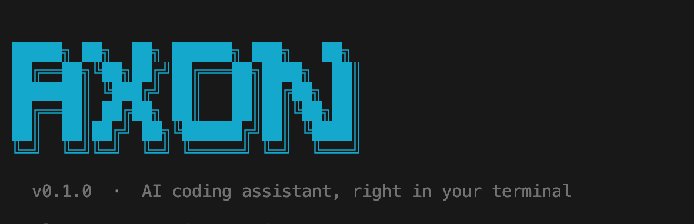

# axon


> axon 是一个跑在本地命令行的 AI  Agent...


**🚧 项目正在积极开发中，欢迎 Star、提 Issue 和 PR 参与共建！**

[快速开始](#-快速开始) · [模型切换](#-切换模型) · [配置说明](#-配置文件) · [扩展机制](#-扩展机制) · [内部机制](#-内部机制) · [参与贡献](#-参与贡献)

---

axon 是一个面向本地开发与自动化任务的 **CLI Agent 框架**，类 ClaudeCode 设计。统一接入 OpenAI / Anthropic / Gemini / DeepSeek / Qwen / MiniMax 等主流模型，原生支持 **工具调用、MCP 扩展、Skill 渐进披露、长期记忆和项目级指令注入**。

## 📦 项目简介

axon 是单仓 TypeScript 项目，纯 Node 运行，零浏览器依赖：

- **CLI 入口** (`src/cli.ts`)：参数解析、子系统初始化、REPL 与单次执行
- **Agent 内核** (`src/agent.ts`)：多轮工具调用循环、流式事件输出、错误恢复
- **工具集** (`src/tools/`)：文件读写、glob、grep、bash、todo、子任务等
- **扩展层**：MCP 客户端、Skill 加载器、Hook 生命周期、长期记忆

### ✨ 核心特性

| 模块 | 实现要点 | 相关文件 |
|---|---|---|
| **🤖 多模型 Agent Loop** | 统一接入 OpenAI / Anthropic / Gemini / DeepSeek / Qwen / MiniMax；流式事件、工具执行、错误恢复、多轮推理 | `agent.ts` `providers/` |
| **🔧 Tool-use 工具系统** | 文件读写编辑、glob 检索、grep 搜索、Bash 执行；Schema 注册、权限校验、危险命令检测 | `tools/` |
| **🔌 MCP 扩展** | 读取本地配置自动 spawn MCP Server 子进程；JSON-RPC 握手、工具发现与注册 | `mcp.ts` |
| **🎓 Skill 技能系统** | `SKILL.md + scripts/references/assets` 目录；元数据发现、`skill_list` / `skill_read` 渐进披露 | `skills.ts` `tools/index.ts` |
| **🪝 Hook 生命周期** | 工具调用前后、LLM 采样后、压缩前后、单轮 / 会话结束等事件钩子 | `hooks.ts` `plugins/` |
| **💾 长期记忆 & Auto-Dream** | 会话摘要落盘；满足条件后台触发 LLM 整合，注入下次会话 system prompt | `memory.ts` `plugins/auto-dream.ts` |
| **📉 4 层上下文压缩** | L1 消息裁剪 → L2 工具结果占位符 → L3 大结果持久化 → L4 LLM 摘要 | `compaction.ts` |

### 🧰 模型可调用的工具

| 工具 | 说明 |
|---|---|
| `bash` | 执行 shell，危险命令需确认 |
| `read_file` / `write_file` | 读写文件 |
| `edit_file` | 精确字符串替换（多处匹配时报错） |
| `list_files` | glob 列文件 |
| `search_files` | grep 搜索 |
| `skill_list` / `skill_read` | 浏览和加载 skills |
| `todo_write` | 任务规划与进度追踪 |

## 🚀 快速开始

### 环境要求

在开始之前，请确保你的开发环境满足以下要求：

- **Node.js**：18 或以上版本
- **npm** / **pnpm** / **yarn**：任选其一
- **API Key**：DeepSeek / OpenAI / Anthropic 等任一模型厂商的 key

### 1️⃣ 安装

**方式一：npm 全局安装（推荐）**

```bash
npm install -g axon-cli
```

**方式二：从源码安装**

```bash
git clone https://github.com/yourusername/axon
cd axon
npm install && npm run build && npm install -g .
```

### 2️⃣ 配置 API Key

任选其一即可：

```bash
# 方式一：全局配置文件（推荐）
mkdir -p ~/.axon
echo '{ "provider": "deepseek", "apiKey": "your-key-here" }' > ~/.axon/config.json

# 方式二：环境变量
export DEEPSEEK_API_KEY=your-key-here
```

### 3️⃣ 开始使用

```bash
axon                                        # 进入交互 REPL
axon "解释这段代码"                          # 单次执行
axon --yolo "批量重命名 src/ 下的文件"       # 跳过所有确认
axon --plan "重构认证模块"                   # 执行前展示计划，逐步确认
axon --model anthropic:claude-3-5-sonnet "review 代码"
npm run dev -- "prompt"                     # 开发时免 build
```

## 🔄 切换模型

格式 `--model provider:model`，或在 `axon.config.json` 里配默认值。

| provider | 模型示例 | 环境变量 |
|---|---|---|
| `deepseek`（默认）| `deepseek-chat` | `DEEPSEEK_API_KEY` |
| `openai` | `gpt-4o` | `OPENAI_API_KEY` |
| `anthropic` | `claude-3-5-sonnet-20241022` | `ANTHROPIC_API_KEY` |
| `gemini` | `gemini-1.5-pro` | `GEMINI_API_KEY` |
| `qwen` | `qwen-max` | `DASHSCOPE_API_KEY` |

> Anthropic 需额外安装：`npm install @anthropic-ai/sdk`

## ⚙️ 配置文件

配置分两层，本地覆盖全局，`mcpServers` 和 `plugins` 合并。

### 全局配置 `~/.axon/config.json`

对所有项目生效：

```json
{
  "provider": "deepseek",
  "model": "deepseek-chat",
  "apiKey": "${DEEPSEEK_API_KEY}"
}
```

### 项目配置 `axon.config.json`

放在项目根目录，覆盖全局：

```json
{
  "model": "deepseek-reasoner",
  "mcpServers": {
    "brave-search": {
      "command": "npx",
      "args": ["-y", "@modelcontextprotocol/server-brave-search"],
      "env": { "BRAVE_API_KEY": "${BRAVE_API_KEY}" }
    }
  },
  "plugins": ["./hooks/audit.js"]
}
```

> `apiKey` 支持 `${ENV_VAR}` 语法引用环境变量，避免明文写入配置文件。

## 🧩 扩展机制

### 🎓 Skills

`.agents/skills/<name>/SKILL.md`，启动时自动发现，模型通过 `skill_list` / `skill_read` 按需加载。

```
.agents/skills/
└── company-valuation/
    ├── SKILL.md        # frontmatter(name, description) + 正文
    ├── references/     # skill_read 时列出文件名供模型按需读取
    └── scripts/
```

### 🔌 MCP

`axon.config.json` 里配 `mcpServers`，启动时自动 spawn 子进程，工具名格式 `serverName__toolName`。内置轻量 JSON-RPC，**不依赖 MCP SDK**。

### 💾 记忆

- 每轮结束追加摘要到 `~/.axon/memory/sessions/YYYY-MM-DD.md`
- 触发条件（≥ 10 次会话 或 距上次 > 24h）：后台加文件锁，LLM 整合进 `~/.axon/memory/memory.md`
- 启动时自动注入 system prompt（最多 8KB）

### 🪝 插件

```typescript
module.exports = {
  async onBeforeToolCall({ name, input }) {},
  async onAfterToolCall({ name, output }) {},
  async onTurnEnd({ messages }) {},
  async onSessionEnd({ messages }) {},
};
```

配在 `axon.config.json` 的 `plugins` 数组里。

### 📋 项目上下文

项目根目录（或任意父目录）放 `AGENTS.md`，启动时自动加载并注入 system prompt。

## 🤝 参与贡献

项目仍在持续开发中，非常欢迎各种形式的贡献！

### 贡献方式

- 🐛 **报告 Bug**：遇到问题请提 Issue，附上复现步骤和日志
- 💡 **提出需求**：有好的功能想法欢迎开 Issue 讨论
- 🔧 **提交代码**：Fork 仓库后开发新功能或修复 Bug，完成后发 Pull Request
- 📖 **完善文档**：改进 README、补充注释、优化示例等
- 🎓 **贡献 Skill**：在 `.agents/skills/` 下贡献你的领域技能

### 开发规范

- 注释用中文，函数保持单一职责，超过 40 行考虑拆分
- 工具函数放 `src/tools/`，新增工具需同时在 `index.ts` 注册
- 提交前确保 `npm run build` 和 `npm test` 通过
- Commit message 清晰描述改动内容

```bash
# 本地开发
npm install
npm run dev -- "test prompt"     # 免 build 直接跑
npm test                         # 跑 vitest 单测
npm run build                    # 编译到 dist/
```

如果这个项目对你有帮助，欢迎点个 ⭐ **Star** 支持一下！

## 📄 License

本项目采用 [MIT 协议](LICENSE) 开源。

---

Made with ❤️ for hackers who live in the terminal
