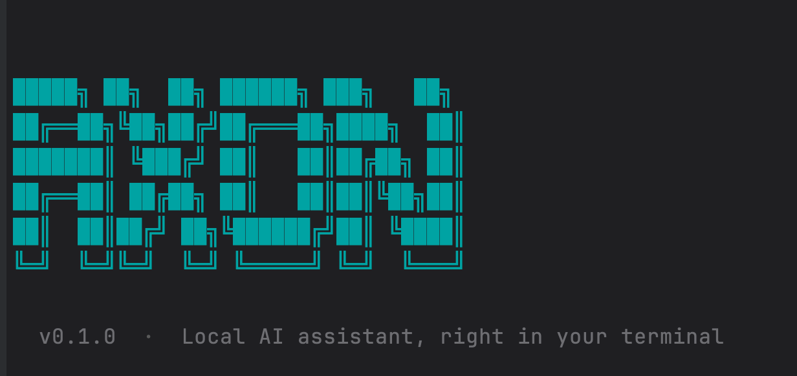
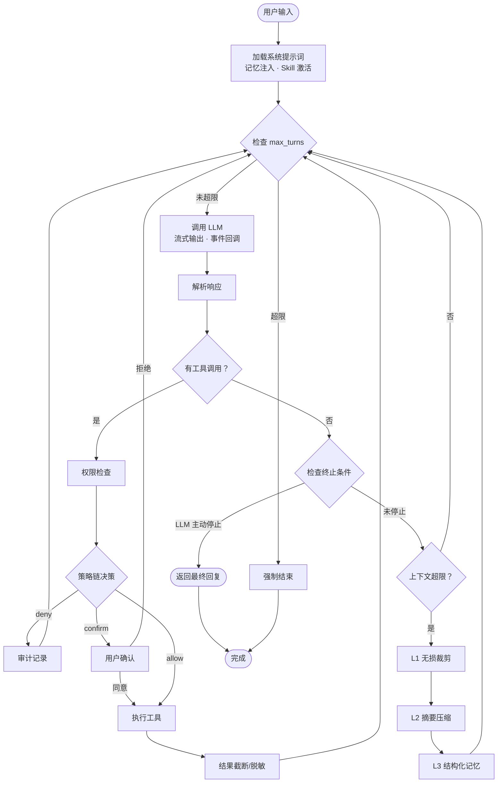
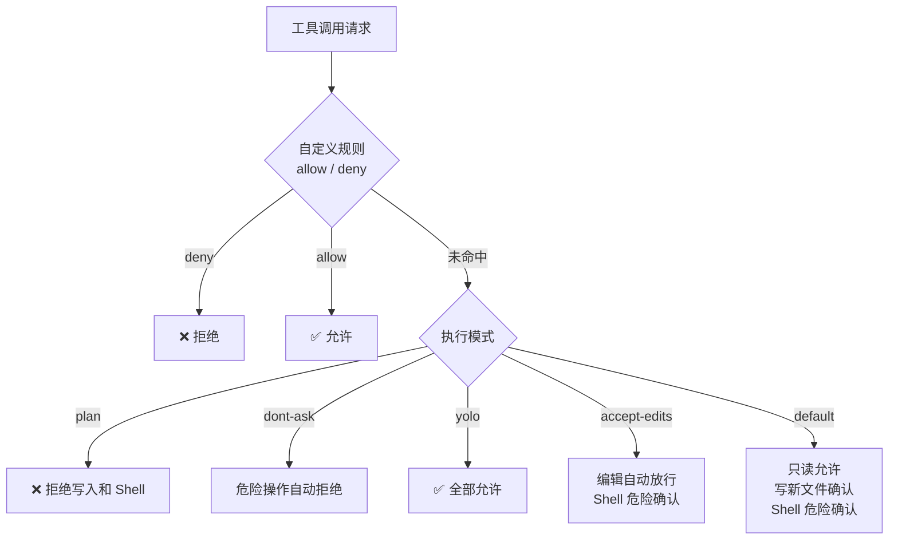

# axon


> axon 是一个类似 Claude Code 的通用 AI Agent，跑在你的终端里。支持多模型接入、工具调用、MCP 扩展、长期记忆和 DAG 任务规划，覆盖从代码读写到自定义技能注入的各类自动化场景。
>
> 配套 10 篇教程从零讲解 Agent Loop、工具系统、权限安全、上下文压缩等核心设计，帮你真正理解 AI Agent 的工程实现。


**🚧 项目正在积极开发中，欢迎 Star、提 Issue 和 PR 参与共建！**


[Agent 能力](#-agent-能力) · [快速开始](#-快速开始) · [模型切换](#-切换模型) · [配置说明](#-配置文件) · [架构设计](#-架构设计) · [扩展机制](#-扩展机制) · [参与贡献](#-参与贡献)

---

## ✨ Agent 能力

| 模块 | 核心设计 |
|---|---|
| **🤖 Agent Loop** | 思考→行动→观察闭环；硬边界（25 轮最大）；流式输出 + 事件解耦 |
| **🔧 工具系统** | ToolSpec 契约 + Schema 自动生成；只读/编辑/Shell 三级分类；延迟加载；并发执行 |
| **🛡️ 权限系统** | 策略链（自定义规则→执行模式→危险评估）；5 种模式；审计日志 |
| **📋 任务规划** | DAG 任务模型：`blockedBy` 依赖、单 in_progress 限制、自动解除阻塞 |
| **🎓 Skill 系统** | 目录 + Markdown 结构；基于 `## 用途` 的精准匹配；`skill-creator` 自举扩展 |
| **💾 记忆系统** | 文件型三段存储；4 种记忆类型；压缩不丢 |
| **🤝 多 Agent** | MCP 协议通信；点对点/广播/流水线三种协作模式；Spawn 动态创建子 Agent |
| **📉 上下文压缩** | 三层递进：无损裁剪→摘要压缩→结构化记忆；"迷失在中间"防御 |
| **📜 System Prompt** | 7 层递进结构：身份→行为边界→任务管理→工具偏好→输出精简 |

配套教学系列 **《从零到一实现一个 AI Agent 框架》**，从最朴素的问题出发，逐步推导每个模块的设计决策：

| # | 标题 | 核心内容 |
|---|---|---|
| 01 | [Agent Loop](docs/tutorials/01-agent-loop.md) | 思考→行动→观察闭环，循环边界 |
| 02 | [工具系统](docs/tutorials/02-tool-system.md) | ToolSpec 契约，Schema 生成，结果治理 |
| 03 | [System Prompt](docs/tutorials/03-system-prompt.md) | 反模式接种，爆炸半径框架，7 层递进结构 |
| 04 | [任务规划](docs/tutorials/04-task-planning.md) | DAG 任务模型，`blockedBy` 依赖，持久化 |
| 05 | [权限系统](docs/tutorials/06-permission-system.md) | 策略链，5 种执行模式，审计日志 |
| 06 | [上下文管理](docs/tutorials/05-context-management.md) | 三层递进压缩，"迷失在中间"防御 |
| 07 | [Skill 系统](docs/tutorials/05-skill-system.md) | Markdown 技能定义，按需加载，自举扩展 |
| 08 | [记忆系统](docs/tutorials/07-memory-system.md) | 4 种记忆类型，文件存储，压缩不丢 |
| 09 | [多 Agent 协作](docs/tutorials/08-multi-agent-collaboration.md) | MCP 通信协议，三种协作模式，Spawn |
| 10 | [流式输出](docs/tutorials/09-streaming.md) | Streaming chunk，工具调用拼接，重试，AbortSignal |

## 🔬 架构设计

### Agent Loop 工作流



### System Prompt 的 7 层设计

| 层 | 内容 | 作用 |
|----|------|------|
| 1️⃣ Identity | 你是谁，定位是什么 | 建立角色认知 |
| 2️⃣ System | 反模式接种 + 爆炸半径框架 | 设定行为边界 |
| 3️⃣ Doing Tasks | 任务管理系统（DAG 模型） | 拆解复杂目标 |
| 4️⃣ Actions | 工具偏好映射表（用 `read_file` 而非 `cat`） | 选择正确工具 |
| 5️⃣ Using Tools | 各工具的用途和限制 | 具体操作指引 |
| 6️⃣ Tone | 输出风格要求 | 统一表达方式 |
| 7️⃣ Output Efficiency | 输出精简要求 | 减少废话 |

### 权限策略链



### 上下文三层压缩

```
L1 无损裁剪 → 省 30-50%，0 信息损失
    保留头 3 条 + 尾部，丢弃中间轮次
     如果不够 ↓
L2 摘要压缩 → 再省 60-80%，保留关键信息
    按语义段落选择性摘要，不压缩核心工具结果
     如果还不够 ↓
L3 结构化记忆 → 极度精简，只保留必须记住的
    提炼到 ~/.axon/memory/，下次会话恢复
```

## 🚀 快速开始

### 环境要求

- **Node.js**：18 或以上版本
- **API Key**：DeepSeek / OpenAI / Anthropic 等任一模型厂商的 key

### 1️⃣ 安装

**全局安装：**
```bash
npm install -g axon-cli
```

**从源码安装：**
```bash
git clone https://github.com/yourusername/axon
cd axon
npm install && npm run build && npm install -g .
```

### 2️⃣ 配置 API Key

```bash
# 方式一：全局配置文件（推荐）
mkdir -p ~/.axon
echo '{ "provider": "deepseek", "apiKey": "your-key-here" }' > ~/.axon/config.json

# 方式二：环境变量
export DEEPSEEK_API_KEY=your-key-here
```

### 3️⃣ 开始使用

```bash
axon                                        # 进入交互 REPL
axon "解释这段代码"                          # 单次执行
axon --yolo "批量重命名 src/ 下的文件"       # 跳过所有确认
axon --plan "重构认证模块"                   # 仅分析，不执行
axon --model anthropic:claude-3-5-sonnet "review 代码"
npm run dev -- "prompt"                     # 开发时免 build
```

### 4️⃣ 运行回归评测

```bash
npm run eval:memory   # 记忆系统离线回归
npm run eval:web      # web_search / web_fetch 回归
```

`eval:web` 会跑一组固定的真实 case，检查：
- 新闻类搜索是否还能返回合理结果
- 搜索结果是否明显跑偏到无关旧内容
- 页面抓取是否还能返回可读正文

## 🔄 切换模型

格式 `--model provider:model`，或在 `axon.config.json` 里配默认值。

| provider | 模型示例 | 环境变量 |
|---|---|---|
| `deepseek`（默认）| `deepseek-chat` | `DEEPSEEK_API_KEY` |
| `openai` | `gpt-4o` | `OPENAI_API_KEY` |
| `anthropic` | `claude-3-5-sonnet-20241022` | `ANTHROPIC_API_KEY` |
| `gemini` | `gemini-1.5-pro` | `GEMINI_API_KEY` |
| `qwen` | `qwen-max` | `DASHSCOPE_API_KEY` |

> Anthropic 需额外安装：`npm install @anthropic-ai/sdk`

## ⚙️ 配置文件

配置分两层，项目配置覆盖全局，`mcpServers` 和 `plugins` 合并。

**全局配置 `~/.axon/config.json`**（对所有项目生效）：
```json
{
  "provider": "deepseek",
  "model": "deepseek-chat",
  "apiKey": "${DEEPSEEK_API_KEY}"
}
```

**项目配置 `axon.config.json`**（放在项目根目录，覆盖全局）：
```json
{
  "model": "deepseek-reasoner",
  "mcpServers": {
    "brave-search": {
      "command": "npx",
      "args": ["-y", "@modelcontextprotocol/server-brave-search"],
      "env": { "BRAVE_API_KEY": "${BRAVE_API_KEY}" }
    }
  },
  "plugins": ["./hooks/audit.js"]
}
```

> `apiKey` 支持 `${ENV_VAR}` 语法引用环境变量，避免明文写入配置文件。

## 🧩 扩展机制

### 🎓 Skills

`.agents/skills/<name>/SKILL.md`，启动时自动发现。

```
.agents/skills/
└── company-valuation/
    ├── SKILL.md       # 用途 + 步骤 + 注意事项
    ├── references/    # skill_read 时列出文件名
    └── scripts/
```

Skill 之间可以互相引用。`skill-creator` 本身也是一个 Skill——实现自举扩展。

### 🔌 MCP

`axon.config.json` 里配 `mcpServers`，启动时自动 spawn 子进程，工具名格式 `serverName__toolName`。内置轻量 JSON-RPC，**不依赖 MCP SDK**。

### 💾 记忆

- 4 种记忆类型：用户、反馈、项目、参考
- 每轮结束追加摘要到 `~/.axon/memory/sessions/YYYY-MM-DD.md`
- 触发条件（≥ 10 次会话 或 距上次 > 24h）：后台加文件锁，LLM 整合进 `~/.axon/memory/memory.md`
- 启动时自动注入 system prompt（最多 8KB）

### 🪝 插件

```typescript
module.exports = {
  async onBeforeToolCall({ name, input }) {},
  async onAfterToolCall({ name, output }) {},
  async onTurnEnd({ messages }) {},
  async onSessionEnd({ messages }) {},
};
```

配在 `axon.config.json` 的 `plugins` 数组里。

### 📋 项目上下文

项目根目录（或任意父目录）放 `AGENTS.md`，启动时自动加载并注入 system prompt。

## 🤝 参与贡献

项目仍在持续开发中，非常欢迎各种形式的贡献！

### 贡献方式

- 🐛 **报告 Bug**：遇到问题请提 Issue，附上复现步骤和日志
- 💡 **提出需求**：有好的功能想法欢迎开 Issue 讨论
- 🔧 **提交代码**：Fork 仓库后开发新功能或修复 Bug，完成后发 Pull Request
- 📖 **完善文档**：改进 README、补充教程、优化示例
- 🎓 **贡献 Skill**：在 `.agents/skills/` 下贡献你的领域技能

### 本地开发

```bash
npm install
npm run dev -- "test prompt"     # 免 build 直接跑
npm test                         # 跑 vitest 单测
npm run build                    # 编译到 dist/
```

如果这个项目对你有帮助，欢迎点个 ⭐ **Star** 支持一下！

## 📄 License

本项目采用 [MIT 协议](LICENSE) 开源。

---

Made with ❤️ for hackers who live in the terminal
