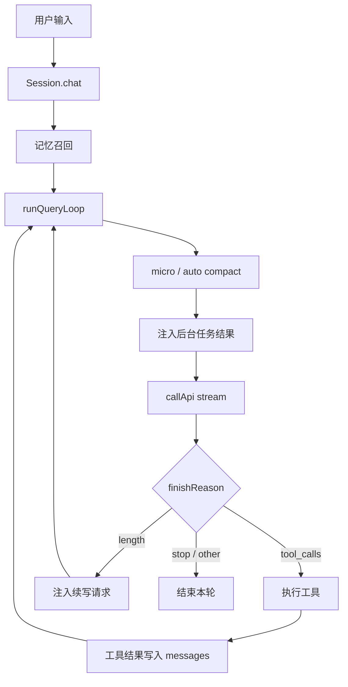
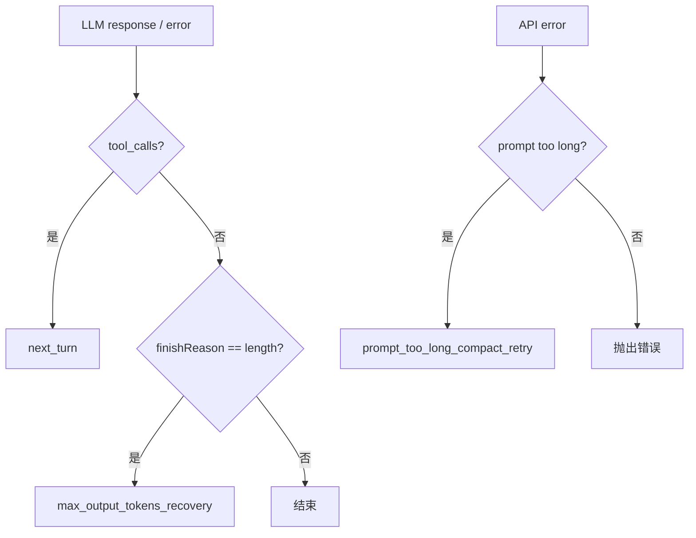
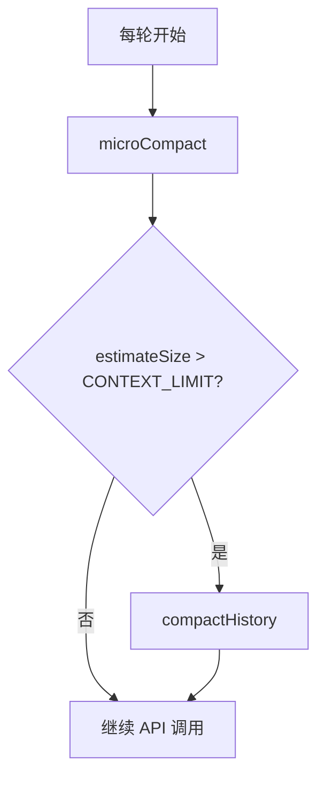
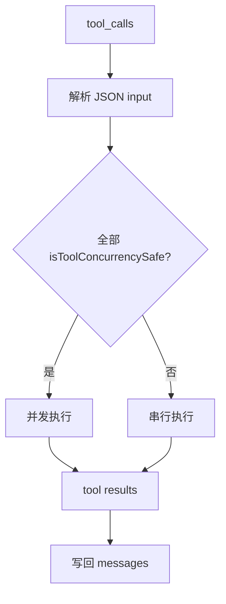

# Axon Agent Loop 设计

## 背景

Agent Loop 是 Axon 的心脏。模型每次只会产生一段文本或一组工具调用，真正的“能持续完成任务”的能力来自循环：

```text
用户输入 -> 调用 LLM -> 执行工具 -> 写回工具结果 -> 再调用 LLM -> 直到模型停止调用工具
```

如果这个循环只处理“有工具就继续、没工具就结束”，早期可以工作，但随着能力增加，很快会遇到几个问题：

1. 上下文可能超限，需要压缩后重试。
2. 模型输出可能因为 `max_tokens` 被截断，需要自动续写。
3. 后台任务可能在下一轮开始前完成，需要把结果注入上下文。
4. 用户可能需要中断长时间运行的请求。
5. 工具执行、压缩和恢复路径需要可观测，否则调试困难。

Axon 的 Agent Loop 设计目标，是在保持简单 while loop 的基础上，增加恢复能力、可中断性和运行指标，而不是引入过重的状态机。

---

## 设计目标

1. **循环清晰**：核心仍然是 LLM -> tools -> LLM 的线性流程。
2. **恢复显式**：每次 `continue` 都有明确原因，方便日志和后续测试。
3. **上下文可控**：每轮先执行 micro compact，必要时触发 auto compact。
4. **输出截断可恢复**：模型因输出限制中断时，自动请求续写。
5. **可中断**：支持 `AbortController`，让 API stream 和工具执行能尽快停止。
6. **可观测**：记录 API 次数、工具轮数、token usage、压缩重试和续写恢复次数。
7. **保持兼容**：不改变工具协议、消息格式和外部调用方式。

---

## 总体结构

Agent Loop 位于 `src/agent.ts`。`Session` 负责会话级生命周期，`runQueryLoop()` 负责单轮用户请求的内部循环。

```text
src/agent.ts
├── Session.chat()          # 接收用户输入，建立 abort controller
├── injectRelevantMemories  # 召回长期记忆
├── runQueryLoop()          # 单轮 Agent Loop
├── callApi()               # 流式调用 LLM
├── dispatch(...)           # 执行工具
└── getMetrics()            # 暴露运行指标
```



---

## 消息增长模型

Axon 使用 OpenAI Chat Completions 风格消息。每次工具轮通常会增加两类消息：

```text
[
  { role: "user", content: "帮我修复 bug" },
  { role: "assistant", content: "...", tool_calls: [...] },
  { role: "tool", tool_call_id: "...", content: "工具结果" },
  { role: "assistant", content: "继续分析...", tool_calls: [...] },
  { role: "tool", tool_call_id: "...", content: "编辑结果" },
  { role: "assistant", content: "已完成" }
]
```

模型每轮都能看到历史消息，所以它能基于已读取的文件、工具结果和之前的决策继续工作。

工具结果直接以 `role: "tool"` 写回历史，并通过 `tool_call_id` 关联到 assistant 的 tool call。

---

## Continue Reason

过去的循环逻辑依赖裸 `continue`。现在 Axon 为主要继续路径记录 `ContinueReason`：

| Continue Reason | 触发场景 | 处理方式 |
|---|---|---|
| `next_turn` | 模型返回 `tool_calls` | 执行工具，把结果写回，再继续 |
| `manual_compact_retry` | 模型调用 `compact` | 压缩历史后继续 |
| `prompt_too_long_compact_retry` | API 报 prompt/context 超限 | 强制压缩历史后重试 |
| `max_output_tokens_recovery` | 模型输出被 token 上限截断 | 注入续写请求后继续 |
| `background_result_continuation` | 后台任务完成 | 把后台结果注入上下文 |



这些 reason 会写入日志和 metrics，后续排查“为什么循环又跑了一轮”时不需要猜。

---

## 上下文压缩

Axon 在每轮调用 LLM 前都会运行压缩流水线：

1. **micro compact**：把较早的工具结果替换成短占位符。
2. **auto compact**：当 messages 估算大小超过阈值时，用 LLM 生成摘要。
3. **manual compact**：模型主动调用 `compact` 工具时触发压缩。

对应实现位于 `src/compaction.ts`。



压缩前会把完整 transcript 写入 `.axon/transcripts/`，便于事后审查。

---

## Prompt Too Long 恢复

如果 API 调用抛出 `prompt_too_long` 或类似 token 超限错误，Axon 不会立即把错误暴露给用户，而是先尝试恢复：

```text
prompt too long
  -> compactHistory(messages)
  -> continue
  -> 重新调用 LLM
```

这是一种“错误扣留”策略：可自动恢复的错误先在 loop 内消化，只有不可恢复时才向上抛出。

---

## Max Output Tokens 恢复

当模型响应因为输出上限被截断时，OpenAI 风格 API 通常会返回：

```text
finish_reason = "length"
```

如果这次响应没有工具调用，Axon 会自动追加一条续写请求：

```xml
<continuation-request>
Your previous response was cut off by the model output limit.
Continue from exactly where you stopped.
Do not repeat completed text unless needed for coherence.
</continuation-request>
```

然后继续调用模型。每轮最多恢复 3 次，避免无限续写。

这让长回答或长总结更稳，不会因为一次输出截断直接结束。

---

## 工具执行

模型返回 `tool_calls` 时，Axon 会：

1. 解析每个 tool call 的 JSON arguments。
2. 判断整批工具是否都并发安全。
3. 如果全部安全，用 `Promise.all` 并发执行。
4. 否则按顺序执行。
5. 把每个结果作为 `role: "tool"` 消息写回历史。



并发策略故意保守：只有整批工具都安全才并发。只要包含写入、shell、未知工具或外部副作用工具，就串行执行。

---

## AbortController

`Session.chat()` 会为本轮请求创建一个 `AbortController`：

```ts
this.abortController = new AbortController()
```

中断入口：

```ts
session.abort()
```

当前中断检查点包括：

- 每轮 loop 开始前。
- API 调用抛错后。
- 读取 stream chunk 时。
- 工具执行前。
- 串行工具批次的每个工具之间。

API stream 调用也会接收 `signal`，这样网络请求可以尽快被取消。

---

## Metrics

Axon 维护一组 loop metrics：

```ts
interface LoopMetrics {
  apiCalls: number;
  toolRounds: number;
  totalInputTokens: number;
  totalOutputTokens: number;
  lastInputTokens: number;
  lastOutputTokens: number;
  compactRetries: number;
  maxOutputRecoveries: number;
  continueReasons: Record<string, number>;
}
```

外部可以通过：

```ts
session.getMetrics()
```

读取当前会话指标。

这些指标用于回答：

- 本轮调用了几次 API？
- 发生了几轮工具调用？
- 压缩重试了几次？
- 输出截断恢复了几次？
- 各类 continue reason 分布如何？
- 当前 provider 是否返回了 token usage？

流式请求会启用：

```ts
stream_options: { include_usage: true }
```

如果 provider 支持，Axon 会累计 `prompt_tokens` 和 `completion_tokens`。

---

## 后台任务结果注入

`background_run` 启动的任务可能在后续 loop 中完成。每轮 API 调用前，Axon 会检查已完成任务：

```text
getCompletedTasksSummaries()
```

如果有结果，会注入一条 user 消息：

```xml
<background-results>
...
</background-results>
```

这让模型能在下一次推理时自然看到异步任务结果，而不必用户手动查询。

---

## 为什么不做流式早启动工具

Claude Code 这类系统会在模型流式输出期间，一旦某个 tool call JSON 完整，就提前执行工具。这样可以把工具耗时隐藏在模型输出窗口里。

Axon 暂时不做这个优化，原因是：

1. 需要判断流式 JSON 是否已经完整。
2. 权限确认可能打断 stream 期间的执行。
3. hook、审计、并发安全和结果顺序会更复杂。
4. 当前已支持响应完成后的只读工具并发，收益已经覆盖常见多文件读取场景。

因此目前选择更可预测的策略：等模型响应完成后，再按安全规则执行工具。

---

## 设计取舍

### 保留 while loop，而不是状态机

Axon 的 loop 仍然是线性 `while (true)`。恢复路径通过 `ContinueReason` 记录，而不是引入复杂状态机。

这样代码更容易读，也更适合当前 CLI 场景。

### 错误先恢复，失败再暴露

`prompt_too_long` 和 `finish_reason === "length"` 都属于可恢复错误。Axon 会先在 loop 内处理：

- 能恢复：用户无感知。
- 不能恢复：再抛出或结束。

这比立即报错更符合 agent 的工作方式。

### 中断是尽快停止，不是强杀

`AbortController` 能取消 API 请求，也能让 loop 在检查点退出。但已经进入某些同步工具调用时，无法强行终止该同步操作。

对于长时间命令，仍建议使用 `background_run`，而不是同步 `bash`。

---

## 后续方向

1. **更细的 loop 事件流**：如果未来有 UI，可以把 loop 改成 async generator 或事件流。
2. **更完整的 usage 兼容**：不同 provider 的 usage 字段不完全一致，可以做适配层统一。
3. **中断可取消工具**：让部分工具接收 abort signal。
4. **loop metrics 持久化**：把每轮 metrics 写入 transcript 或单独日志。
5. **分组并发调度**：未来可以按读写集合拆分工具批次，而不是整批全安全才并发。
6. **Stop hook**：任务完成前允许插件检查是否还有未完成约束，必要时阻止结束。

---

## 小结

Axon 的 Agent Loop 设计坚持一个原则：

> 循环本身保持简单，但每个继续、恢复和中断路径都要可解释。

`runQueryLoop()` 仍然是 LLM 与工具之间的线性循环；`ContinueReason` 让恢复路径可观测；`AbortController` 让长流程可中断；metrics 让运行成本和行为可分析。这样既保留了 Axon 的轻量实现，也为更复杂的本地 Agent 能力留下了空间。
