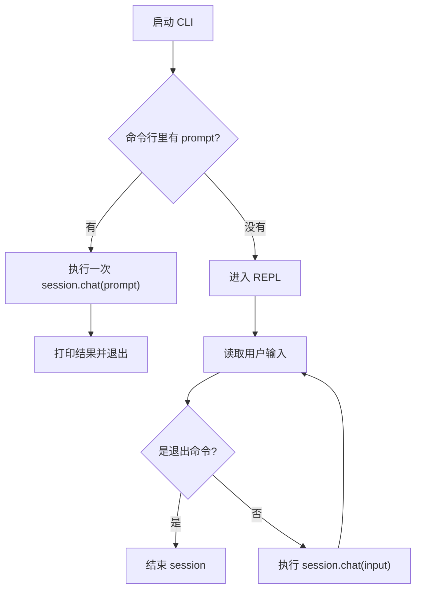
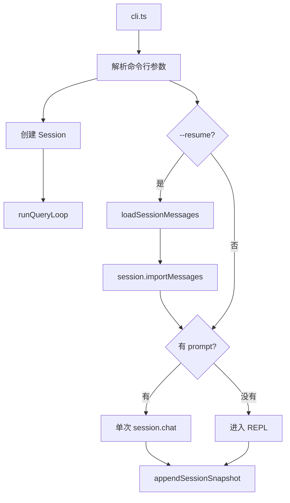
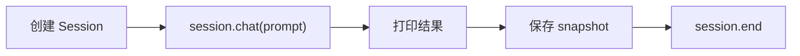
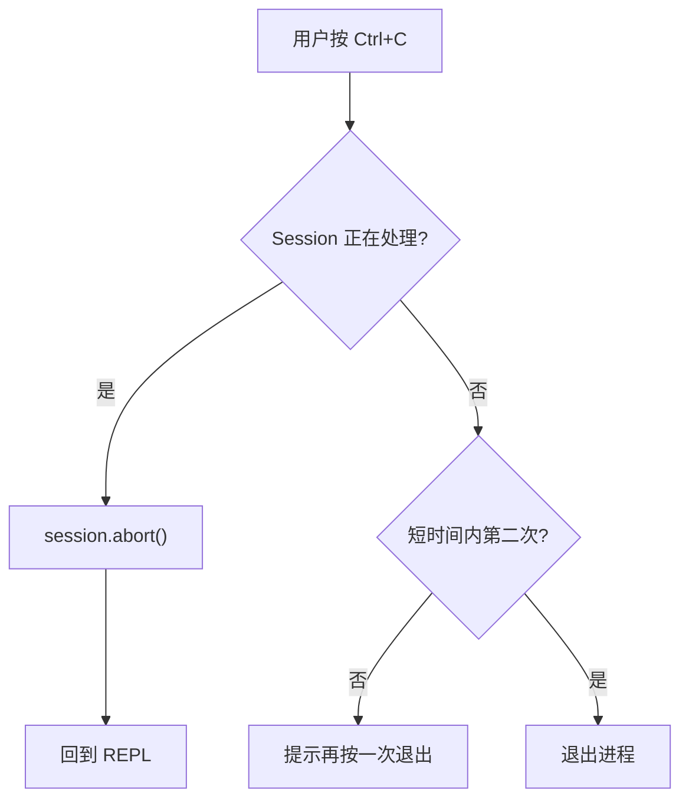
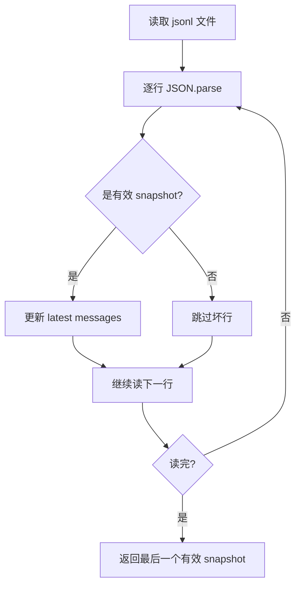
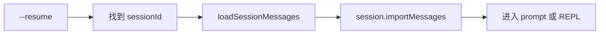

# CLI 会话系统：让 Agent 变得可控

> 从零到一实现一个 AI Agent 框架 · CLI 与 Session 篇

---

## 1. 为什么需要 CLI Session？

先看一个很常见的场景。

你在终端里启动一个 Agent：

```bash
axon
```

然后输入：

```text
帮我分析这个项目的工具系统，并写一篇设计文档
```

Agent 开始读文件、调用工具、总结、写文档。问题来了：

- 如果它跑偏了，怎么中断？
- 如果上下文太长了，怎么手动压缩？
- 如果想看这轮用了多少 token，怎么看？
- 如果终端关了，下次怎么接着聊？
- 如果只想跑一次命令，不想进交互模式，怎么办？

这些问题都不属于模型能力，也不属于工具系统。它们属于另一个层面：

> 用户如何在终端里控制一个正在运行的 Agent。

这就是 **CLI Session 系统** 要解决的问题。

没有 Session 的 Agent，像一个一次性脚本；有了 Session，才像一个可以长期协作的终端伙伴。

---

## 2. 从零开始：最小 CLI Session

先不看 Axon 的代码，我们自己推一版最小实现。

一个终端 Agent 至少需要两种启动方式：

```bash
# 单次 prompt
axon "解释 src/agent.ts"

# 交互式 REPL
axon
```

流程大概是这样：



伪代码可以写得很短：

```ts
async function main() {
  const session = new Session()

  if (promptFromArgs) {
    const answer = await session.chat(promptFromArgs)
    console.log(answer)
    await session.end()
    return
  }

  while (true) {
    const input = await readline("> ")

    if (input === "exit") {
      await session.end()
      break
    }

    const answer = await session.chat(input)
    console.log(answer)
  }
}
```

这就是最小 CLI Session。

但这个版本很快会遇到问题。

---

## 3. 最小实现会坏在哪里？

### 3.1 Ctrl+C 到底是中断，还是退出？

用户按 Ctrl+C，可能有两种意思：

```text
Agent 正在跑：停一下，别继续了
Agent 没在跑：我要退出 CLI
```

如果不区分状态，就会出现两种糟糕体验：

- Agent 正在调用工具时，用户没法打断，只能等。
- 用户只是手滑按了一下 Ctrl+C，整个会话直接没了。

所以 CLI 需要知道 Session 当前是不是正在处理任务。

### 3.2 REPL 里需要控制命令

交互式会话不是只有“问问题”。

用户还会想做这些事：

```text
/clear       清空上下文
/compact     手动压缩上下文
/metrics     查看当前会话指标
/mode plan   切换权限模式
/help        查看命令
```

这些命令不应该丢给 LLM。它们是 CLI 自己的控制面。

### 3.3 进程退出后上下文会丢

最小实现里，所有 messages 都在内存里：

```ts
const messages = []
```

进程一退出，历史就没了。

对 Agent 来说，这很伤。用户前面解释过的背景、项目结构、偏好，全都要重来。

### 3.4 指标不透明

Agent 看起来只是在“思考”，但背后其实发生了很多事情：

- 调了几次 API？
- 跑了几轮工具？
- 输入输出 token 是多少？
- 有没有触发自动压缩？
- 有没有因为输出太长而继续生成？

如果这些信息不可见，用户就很难判断 Agent 当前的成本和状态。

---

## 4. 工程演进：CLI Session 要解决什么？

从最小实现走到可用实现，需要补上 4 个能力。

| 能力 | 解决什么问题 |
|------|--------------|
| **双模式启动** | 支持一次性命令和持续 REPL |
| **可中断** | Agent 跑偏时能停止当前任务 |
| **控制命令** | 用户能清空、压缩、切模式、看指标 |
| **会话恢复** | 进程退出后可以接着聊 |

Axon 的 CLI Session 就围绕这 4 件事设计。

---

## 5. Axon 的整体结构

相关文件很少：

```text
src/
├── cli.ts             # CLI 参数、REPL、slash commands、resume
├── agent.ts           # Session 类和 agent loop
├── session-store.ts   # 会话保存与恢复
├── project-paths.ts   # .axon 目录路径
└── mode.ts            # 权限模式
```

整体关系如下：



这里有一个重要边界：

> CLI 不直接执行工具，也不直接调用 LLM。CLI 只控制 Session。

这让 CLI 层保持简单。真正的 Agent Loop 仍然在 `Session` 内部。

---

## 6. 单次 Prompt 模式

单次模式适合脚本化调用：

```bash
axon "总结一下这个项目"
```

它的生命周期很短：



简化代码如下：

```ts
if (prompt) {
  const response = await session.chat(prompt)
  console.log(response)
  await appendSessionSnapshot(sessionId, session.exportMessages())
  await session.end()
  return
}
```

这里有个细节：即使是单次 prompt，也会保存 session。

这样用户下次仍然可以：

```bash
axon --resume
```

接着上一次的上下文继续问。

---

## 7. REPL 模式

不带 prompt 启动时，Axon 进入 REPL：

```bash
axon
```

REPL 的主循环可以理解成：

```ts
while (true) {
  const input = await question("> ")

  if (isExit(input)) {
    break
  }

  if (input.startsWith("/")) {
    await handleSlashCommand(input)
    continue
  }

  const response = await session.chat(input)
  console.log(response)
  await appendSessionSnapshot(sessionId, session.exportMessages())
}
```

注意 slash command 在 `session.chat()` 之前处理。

原因很简单：`/clear`、`/metrics`、`/mode` 这些不是给模型的自然语言请求，而是给 CLI 的控制指令。

---

## 8. Ctrl+C 双语义

终端 Agent 的 Ctrl+C 设计非常关键。

Axon 把 Ctrl+C 分成两种情况：

| 当前状态 | Ctrl+C 行为 |
|----------|-------------|
| `session.isProcessing() === true` | 中断当前任务 |
| `session.isProcessing() === false` | 第一次提示，再按一次退出 |

流程如下：



`Session` 内部用 `AbortController` 保存中断信号：

```ts
abort() {
  this.abortController?.abort()
}
```

Agent Loop 调 API 和处理工具轮次时，会检查这个 signal。一旦用户中断，当前任务停止，但整个 REPL 不退出。

这个体验很重要：用户不是要杀掉程序，只是要让这轮 Agent 停手。

---

## 9. Slash Commands：REPL 的控制面

Axon 当前支持这些命令：

| 命令 | 作用 |
|------|------|
| `/help` | 显示帮助 |
| `/clear` | 清空当前会话历史 |
| `/metrics` | 查看当前 Session 指标 |
| `/cost` | `/metrics` 的别名 |
| `/compact` | 手动压缩上下文 |
| `/mode <name>` | 切换权限模式 |
| `exit` / `quit` / `q` | 退出 |

### 9.1 `/clear`

`/clear` 调用：

```ts
session.clearHistory()
```

它清空当前 messages，并重置一些会话内状态。随后 CLI 会保存一个新的 snapshot。

为什么清空后也要保存？

因为用户下次 `--resume` 时，应该恢复到“已清空”的状态，而不是恢复到清空之前。

### 9.2 `/metrics`

`/metrics` 调用：

```ts
session.getMetrics()
```

输出类似：

```json
{
  "apiCalls": 4,
  "toolRounds": 1,
  "totalInputTokens": 17513,
  "totalOutputTokens": 194,
  "lastInputTokens": 4346,
  "lastOutputTokens": 73,
  "compactRetries": 0,
  "maxOutputRecoveries": 0,
  "continueReasons": {
    "next_turn": 1
  }
}
```

这里回答一个容易误解的问题：

> 这是当前进程里当前 `Session` 的累计指标，不是全局指标。

也就是说，`--resume` 会恢复 messages，但不会恢复旧进程的 metrics。

这是一种刻意简化。历史成本统计更适合以后从 session 日志或 transcript 离线分析，不应该混进当前进程的实时指标里。

### 9.3 `/compact`

`/compact` 调用：

```ts
await session.compactNow()
```

它会把当前对话历史压缩成摘要，降低后续请求的上下文成本。

这和 Agent Loop 里的自动压缩互补：

- 自动压缩：模型上下文快撑爆时触发。
- 手动压缩：用户觉得“前面聊太多了”时主动触发。

### 9.4 `/mode`

`/mode` 修改当前权限模式：

```text
/mode default
/mode plan
/mode yolo
/mode accept-edits
/mode dont-ask
```

模式只影响后续工具调用，不改写已经发生的历史。

---

## 10. Session 暴露哪些控制接口？

为了让 CLI 能控制 Agent，`Session` 需要提供一组很小的 public API：

```ts
session.chat(input)
session.abort()
session.isProcessing()
session.clearHistory()
session.compactNow()
session.getMetrics()
session.exportMessages()
session.importMessages(messages)
session.end()
```

这些方法的分工很清楚：

| 方法 | 谁用 | 做什么 |
|------|------|--------|
| `chat` | CLI | 执行一轮用户请求 |
| `abort` | Ctrl+C handler | 中断当前请求 |
| `isProcessing` | Ctrl+C handler | 判断 Ctrl+C 语义 |
| `clearHistory` | `/clear` | 清空上下文 |
| `compactNow` | `/compact` | 手动压缩 |
| `getMetrics` | `/metrics` | 查看指标 |
| `exportMessages` | session-store | 保存快照 |
| `importMessages` | `--resume` | 恢复历史 |

设计原则是：

> CLI 可以控制会话，但不应该知道 Agent Loop 的内部细节。

比如 CLI 不需要知道工具是怎么调度的，也不需要知道压缩摘要怎么生成。它只调用 `compactNow()`。

---

## 11. 会话保存：为什么用 JSONL？

Axon 把会话保存在项目目录下：

```text
.axon/sessions/<sessionId>.jsonl
```

每次保存追加一行 snapshot：

```json
{"ts":"2026-06-27T09:12:30.000Z","kind":"snapshot","messages":[...]}
```

为什么不用一个完整 JSON 文件反复覆盖？

因为终端 Agent 很容易被中断。JSONL 追加写更适合这种场景：

| 方案 | 优点 | 问题 |
|------|------|------|
| 整体 JSON 覆盖 | 文件结构直观 | 崩溃时可能写坏整个文件 |
| JSONL 追加 | 崩溃最多坏最后一行 | 文件会有重复 snapshot |

Axon 选择 JSONL，是为了优先保证恢复可靠。

加载时逻辑也很简单：



这意味着即使最后一行因为进程崩溃只写了一半，恢复也不会失败。

---

## 12. Resume：接上一次的上下文

恢复最近一次会话：

```bash
axon --resume
```

恢复指定会话：

```bash
axon --resume 2026-06-27T09-12-30-123Z
```

恢复流程：



这里也有一个边界：

> Resume 恢复的是对话消息，不恢复进程运行状态。

不会恢复的东西包括：

- abort signal
- 当前是否 processing
- 本进程 metrics
- 正在执行到一半的工具调用

这很合理。进程状态是瞬时的，messages 才是可以跨进程保存的会话语义。

---

## 13. 为什么保存在项目 `.axon/` 下面？

Axon 的 session 默认保存在当前项目：

```text
.axon/sessions/
```

而不是全局目录，比如：

```text
~/.axon/sessions/
```

原因是 Agent 会话通常和项目强绑定。

你在 A 项目里聊的是 A 项目的代码结构、设计取舍、任务上下文；到了 B 项目，这些上下文大多没有意义，甚至会干扰模型。

所以会话跟着 workspace 走：

```text
project-a/.axon/sessions/
project-b/.axon/sessions/
```

这也和 Axon 其他项目状态保持一致，比如 tasks、teams、memory、transcripts。

---

## 14. 设计取舍

### 14.1 不上复杂 TUI

Axon 当前没有引入 Ink、React terminal UI 之类的框架。

不是因为它们不好，而是现在最核心的问题不是“界面更漂亮”，而是：

- 能不能中断？
- 能不能恢复？
- 能不能看指标？
- 能不能切模式？
- 能不能保持实现简单？

`readline + chalk + commander` 已经覆盖了第一阶段需求。

### 14.2 保存 snapshot，而不是事件流

当前每次保存完整 messages snapshot。

优点是恢复简单：

```text
读到最后一个有效 snapshot 就行
```

缺点是长会话会重复存储历史。

未来如果 session 文件膨胀，可以改成事件流：

```text
user_message
assistant_message
tool_result
compact
clear
mode_change
```

但第一版更看重稳定和易懂。

### 14.3 Metrics 不持久化

现在 `/metrics` 看的是当前进程内累计值。

这样做的好处是概念简单：

```text
你现在看到的，就是这个 Session 实例从创建以来发生的事。
```

如果以后要做成本报表，可以把每轮 metrics 写进 JSONL，或者从 transcript 离线统计。

---

## 15. 小结

CLI Session 是 Agent 的控制层。

Agent Loop 让模型能“思考、行动、观察、继续思考”；CLI Session 则让用户能“启动、中断、查看、清空、压缩、恢复”。

Axon 这一层的核心设计可以概括成一句话：

> Agent 可以自主做事，但用户必须始终握着方向盘。

所以它没有一上来做复杂 TUI，也没有设计很重的 session 数据库，而是用最小的一组机制把控制权补齐：

- 单次 prompt 和 REPL 覆盖两种启动方式。
- Ctrl+C 双语义让任务可中断、进程不误退。
- Slash commands 提供轻量控制面。
- JSONL snapshot 让会话可恢复、崩溃可容错。
- Session public API 把 CLI 和 Agent Loop 解耦。

这就是 Axon CLI 会话系统的第一版形态：不复杂，但够用，而且后面可以自然长大。
