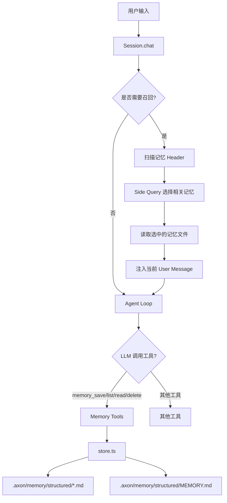
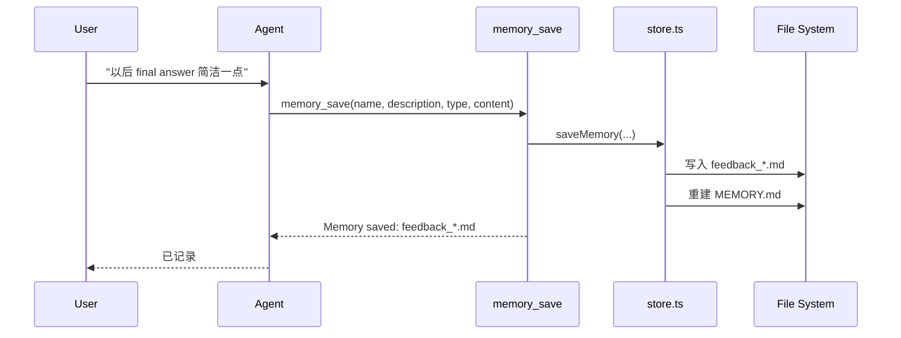
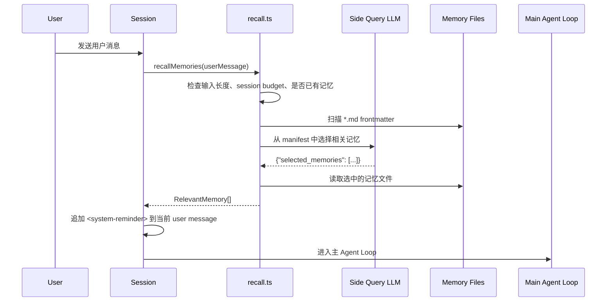
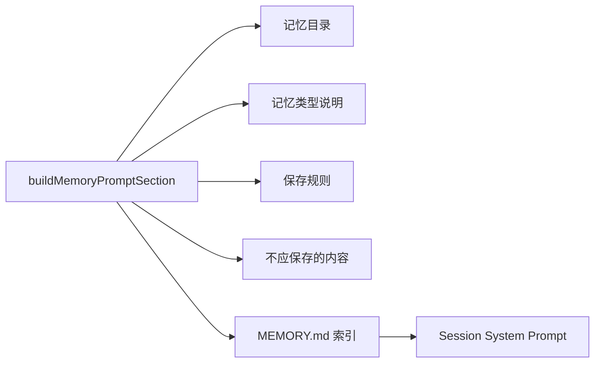
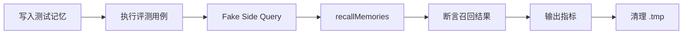

# Axon 持久记忆系统设计

## 背景

通用 AI 助手在不同会话之间默认没有连续记忆。用户需要反复说明协作偏好、工作区背景、历史决策和外部参考资料。对于运行在本地工作区中的智能助理，这会带来两个问题：

1. 重要上下文需要重复输入，降低协作效率。
2. 长期决策和用户反馈无法沉淀，后续任务容易偏离既定约束。

Axon 的记忆系统用于保存长期有效的信息，并在后续对话中按需召回。它不是替代资料读取、工具查询或历史记录，而是保存“当前资料里不一定能看出来，但会影响协作和决策”的上下文。

---

## 设计目标

1. **工作区隔离**：每个工作区的记忆存放在当前工作区的 `.axon/` 目录下，避免跨工作区污染。
2. **人类可读**：每条记忆都是 Markdown 文件，用户可以直接查看、编辑和删除。
3. **结构化保存**：用 frontmatter 标注名称、描述和类型，便于索引和召回。
4. **语义召回**：根据当前用户输入选择相关记忆，而不是把全部记忆塞进上下文。
5. **低依赖成本**：不引入数据库、向量库或 embedding 服务，优先使用文件系统和当前 LLM。
6. **上下文可控**：限制单条记忆和单会话累计注入大小，避免记忆挤占主上下文。

---

## 总体架构

记忆系统位于 `src/features/memory/`，按职责拆分为路径、解析、存储、召回、提示和工具层。

```text
src/features/memory/
├── types.ts       # 类型定义
├── paths.ts       # 工作区记忆路径
├── frontmatter.ts # Frontmatter 解析和格式化
├── store.ts       # 文件存储、索引、CRUD
├── recall.ts      # 语义召回和注入格式化
├── tools.ts       # 暴露给 LLM 的 memory_* 工具
├── prompt.ts      # 系统提示中的记忆说明
└── index.ts       # 统一导出
```



---

## 存储设计

### 路径

结构化记忆默认存放在：

```text
.axon/memory/structured/
```

该目录属于工作区级 Axon 状态。它和 `.axon/tasks`、`.axon/teams`、`.axon/transcripts` 一样，默认不进入版本控制。

### 记忆文件格式

每条记忆是一个 Markdown 文件，文件名由 `type + name` 派生：

```text
task_planning_preference.md
feedback_concise_answers.md
```

文件内容使用 YAML 风格 frontmatter：

```markdown
---
name: task planning preference
description: User prefers explicit plans for multi-step tasks.
type: project
---

For multi-step tasks, produce a clear plan, track progress, and summarize outcomes briefly.
```

字段说明：

| 字段 | 说明 |
|------|------|
| `name` | 短名称，用于生成文件名和展示 |
| `description` | 一句话描述，用于召回阶段的语义选择 |
| `type` | 记忆类型：`user`、`feedback`、`project`、`reference` |

### 四类记忆

| 类型 | 保存内容 | 示例 |
|------|----------|------|
| `user` | 用户身份、偏好、知识水平、沟通风格 | 用户偏好简洁的任务总结 |
| `feedback` | 用户纠正、行为准则、后续应如何应用 | 处理任务时不要做无关扩展 |
| `project` | 工作区目标、长期决策、约束和背景 | 当前工作区采用结构化文件记忆 |
| `reference` | 外部资源、链接、工具、文档入口 | DeepSeek API 文档地址 |

不建议保存：

- 临时事实或可实时查询的信息，应该通过当前资料或工具确认。
- 操作历史或外部状态，应该通过对应工具查询。
- 已经写在工作区文档中的事实。
- 临时任务进度和短期状态。

### 索引文件

`store.ts` 自动维护：

```text
.axon/memory/structured/MEMORY.md
```

索引示例：

```markdown
# Memory Index

- **[task planning preference](task_planning_preference.md)** (project) — User prefers explicit plans for multi-step tasks.
- **[concise answers](feedback_concise_answers.md)** (feedback) — User prefers concise final answers.
```

`MEMORY.md` 的作用是为人类和 LLM 提供快速目录。写入、删除记忆时，索引会自动重建。

---

## 写入流程

模型通过工具保存记忆，而不是直接手写索引。



### 暴露给模型的工具

| 工具 | 功能 |
|------|------|
| `memory_save(name, description, type, content)` | 保存或覆盖一条结构化记忆 |
| `memory_list()` | 列出当前工作区的所有结构化记忆 |
| `memory_read(filename)` | 读取指定记忆文件 |
| `memory_delete(filename)` | 删除指定记忆文件并更新索引 |

写入触发由系统提示约束：当用户明确要求记住某事、给出长期反馈、设置未来偏好、做出长期决策或提供长期参考资料时，模型应调用 `memory_save`。

---

## 召回流程

召回发生在每轮用户输入进入主 Agent Loop 之前。系统先判断是否值得召回，再通过 side query 从记忆索引中选择相关文件。



### 召回门槛

为了避免每个短输入都触发额外调用，召回层有几条 gate：

- 输入为空时不召回。
- CJK 输入少于 2 个字符时不召回。
- 英文输入没有空格分隔时不召回。
- 当前 session 累计注入记忆超过 60KB 后不再召回。
- 当前工作区没有记忆文件时不召回。
- 同一个 session 中已经注入过的记忆不会重复注入。

### Side Query

Side Query 是一次独立的小型 LLM 调用。它只接收当前用户输入和记忆 manifest，不接收完整主对话历史。

输入形式：

```text
Query: 继续做市场分析资料整理

Available memories:
- [project] reference_research_sources.md (...): Preferred research sources for recurring analysis tasks.
- [feedback] feedback_concise_answers.md (...): User prefers concise final answers.
```

期望输出：

```json
{
  "selected_memories": ["reference_research_sources.md"]
}
```

这个调用会产生额外延迟和成本，但不会把所有记忆直接加入主上下文。

### 注入格式

被选中的记忆以 `<system-reminder>` 形式追加到当前 user message 后面：

```text
<system-reminder>
Memory (saved today): .axon/memory/structured/reference_research_sources.md:

---
name: research sources
description: Preferred research sources for recurring analysis tasks.
type: reference
---

Prefer official filings, primary docs, and saved reference links before secondary summaries.
</system-reminder>
```

该设计避免改变 system prompt，并让记忆只在相关轮次进入上下文。

---

## Prompt 集成

`prompt.ts` 负责生成系统提示中的记忆说明。提示内容包括：

1. 当前工作区的结构化记忆目录。
2. 四类记忆的定义。
3. 什么时候应该调用 `memory_save`。
4. 哪些内容不应该保存为记忆。
5. 当前 `MEMORY.md` 索引内容。



---

## 为什么不使用向量库

当前方案没有引入 Chroma、Pinecone、FAISS 或 embedding 服务，主要原因如下：

1. **部署简单**：文件系统即可运行，不需要额外服务。
2. **数据可见**：用户可以直接查看和编辑每条记忆。
3. **规模匹配**：早期工作区级记忆数量通常有限，manifest + side query 足够处理。
4. **解释性强**：召回依据是文件名和 description，便于调试。
5. **演进空间清晰**：当记忆数量增长到一定规模时，可以在现有文件格式之上增加 embedding 索引。

该设计不是排斥向量检索，而是先用较低复杂度满足当前产品阶段。

---

## 成本与边界

| 维度 | 当前策略 |
|------|----------|
| 单文件大小 | 召回时最多读取 4KB |
| 单会话注入 | 累计最多 60KB |
| 单次召回数量 | 最多 5 条 |
| 索引大小 | 最多 200 行或 25KB |
| 记忆数量扫描 | 最多扫描 200 个文件 header |

### 已知限制

- Side Query 依赖 LLM 的选择质量，可能漏召回或误召回。
- 记忆数量较大时，manifest 会增加额外 token 成本。
- 当前没有自动合并、去重、过期和归档策略。
- `memory_save` 是覆盖式写入，同名记忆会更新同一个文件。
- 记忆是历史观察，不应作为当前事实的唯一依据。

---

## 离线评测

当前仓库提供了一个确定性的离线评测脚本，用于验证召回层的基础行为：

```bash
npm run eval:memory
```

评测脚本会在 `.tmp/memory-offline-eval` 中临时写入一组结构化记忆，使用假的 side query 返回固定选择结果，然后检查召回层是否满足预期。它不调用真实模型，因此适合放进本地回归测试或 CI。



主要覆盖场景：

1. 能召回用户偏好、反馈、项目背景和参考资料。
2. 短输入、预算耗尽、无可用记忆时不会触发无效召回。
3. 同一 session 已经注入过的记忆不会重复注入。
4. 单次最多召回 5 条。
5. 大文件注入时会被截断。

输出指标包括：

| 指标 | 含义 |
|------|------|
| `pass rate` | 用例整体通过率 |
| `recall@5` | 预期记忆在 top 5 中被召回的比例 |
| `precision proxy` | 基于显式反例的误召回代理指标 |
| `no-recall gate accuracy` | 不应召回场景中成功返回空结果的比例 |

---

## 与 Auto-Dream 的关系

Axon 目前同时存在两类记忆：

```text
.axon/memory/dream/       # Auto-Dream 会话摘要记忆
.axon/memory/structured/  # 结构化文件记忆
```

两者定位不同：

| 系统 | 作用 |
|------|------|
| Auto-Dream | 从会话日志中生成摘要，作为粗粒度长期上下文 |
| Structured Memory | 保存明确、可编辑、可召回的长期事实和偏好 |

后续可以将 Auto-Dream 调整为“候选记忆生成器”：它从会话日志中发现可能值得保存的内容，再由模型或用户确认是否写入结构化记忆。

---

## 未来演进

1. **记忆更新工具**：增加 `memory_update`，避免 read-delete-save 的间接流程。
2. **召回审计日志**：记录每次召回了哪些记忆，便于分析误召回。
3. **自动去重**：保存前检测同类记忆，提示更新而不是新增。
4. **归档策略**：长期未召回的记忆进入 archive，不参与默认召回。
5. **分层召回**：记忆数量较多时先按 type 选择候选，再做 top-k。
6. **可选向量索引**：在保持 Markdown 作为事实源的前提下增加 embedding 加速。

---

## 总结

Axon 的结构化记忆系统采用“Markdown 文件 + MEMORY.md 索引 + LLM 语义选择”的方案。它优先保证可读、可控和易部署，同时避免把全部长期记忆注入每轮对话。

该方案适合当前阶段的通用本地 AI 助手：实现成本低，用户可直接审计，后续也可以平滑扩展到更复杂的检索策略。
