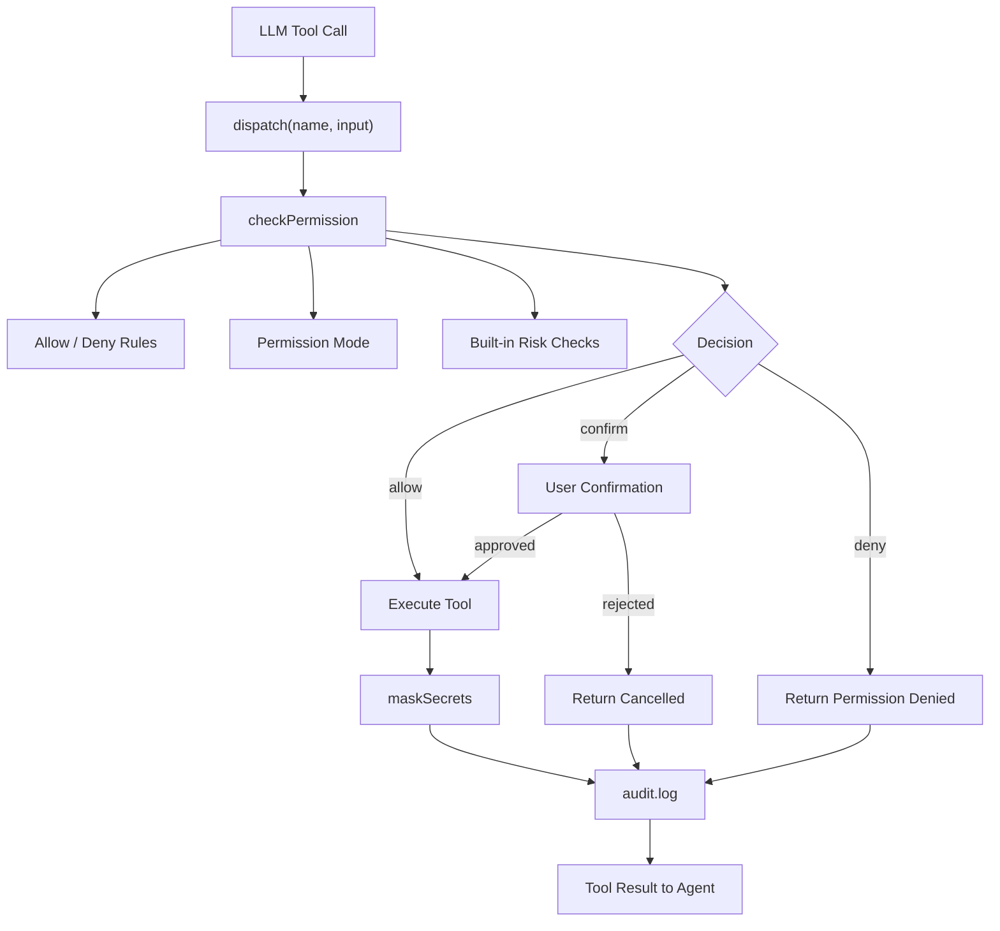
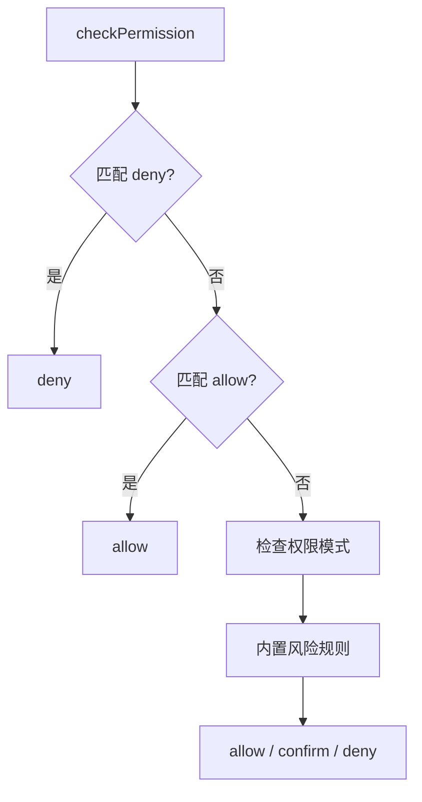
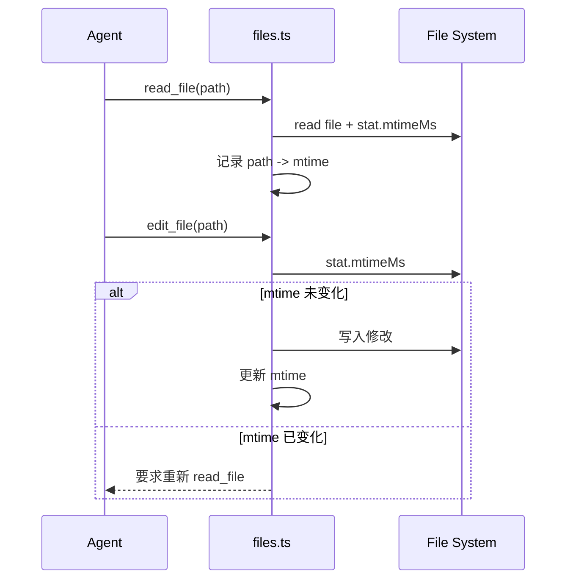

# Axon 权限与安全系统设计

## 背景

通用 AI 助手一旦接入工具，就不只是生成文本，而是可以读取文件、修改文件、执行命令、启动后台任务和调用外部 MCP 工具。风险主要来自工具执行能力，而不是模型文本本身。

如果没有权限系统，几个常见问题会变得难以控制：

1. 模型可能执行超出用户意图的写入、删除或发布操作。
2. shell 命令、后台任务和 MCP 工具可能影响本机或外部系统。
3. 文件在读取和写入之间可能被用户或其他进程修改，导致覆盖用户工作。
4. API key、token、私钥等敏感信息可能进入日志、工具结果或长期记忆。
5. 发生问题后缺少审计记录，难以知道哪个工具在什么时候做了什么。

Axon 的权限与安全系统用于在工具执行前建立统一边界：哪些操作可以直接执行，哪些需要确认，哪些应该被拒绝，以及执行后如何留下可追踪记录。

---

## 设计目标

1. **统一入口**：所有工具调用都经过同一个权限判断流程，而不是分散在各工具内部。
2. **模式清晰**：通过 `default`、`plan`、`yolo`、`accept-edits`、`dont-ask` 表达不同自动化程度。
3. **可配置规则**：支持用户和项目级 allow / deny 规则，便于固定常用安全策略。
4. **默认保守**：只读工具默认允许，高风险写入、shell 和外部工具默认确认或拒绝。
5. **保护用户工作**：已有文件写入前必须先读取，并通过 `mtime` 校验避免覆盖外部修改。
6. **敏感信息保护**：工具输出和审计日志对常见 secret 做脱敏。
7. **可审计**：记录工具名、输入摘要、权限决策和输出预览，便于定位问题。

---

## 总体架构

权限系统的核心在 `src/permissions.ts`，工具分发入口在 `src/tools/index.ts`。

```text
src/
├── permissions.ts      # 权限规则、模式判断、危险命令、脱敏、审计
├── mode.ts             # 当前权限模式
├── agent.ts            # 注入权限说明到 system prompt
└── tools/
    ├── index.ts        # 工具统一分发，调用权限层
    ├── bash.ts         # shell 执行
    ├── files.ts        # 文件读写和 mtime 校验
    └── background.ts   # 后台 shell 任务
```



该设计把“能不能执行”放在工具真正执行之前。具体工具只负责自己的业务逻辑，例如 `bash.ts` 只执行命令，`files.ts` 只处理文件读写。

---

## 权限模式

Axon 支持五种模式：

| 模式 | 启动参数 | 行为 |
|------|----------|------|
| `default` | 默认 | 只读工具直接执行，高风险操作需要确认 |
| `plan` | `--plan` | 只读规划模式，阻止写入和 shell |
| `yolo` | `--yolo` | 跳过确认，适合完全信任的本地环境 |
| `accept-edits` | `--accept-edits` | 自动允许文件编辑，仍确认危险 shell |
| `dont-ask` | `--dont-ask` | 非交互模式，需要确认的操作自动拒绝 |

### 为什么需要多种模式

不同使用场景对自动化和安全性的要求不同：

- 日常交互适合 `default`，让低风险操作快速执行，高风险操作停下来确认。
- 调研和方案设计适合 `plan`，保证模型只能读取和规划，不会修改工作区。
- 本地完全信任的批处理适合 `yolo`，但需要用户理解风险。
- 大量代码编辑适合 `accept-edits`，减少重复确认，同时保留危险 shell 的确认。
- CI 或非交互环境适合 `dont-ask`，避免进程卡在确认提示上。

---

## 工具分级

权限层按工具行为将工具分成几类：

| 类型 | 示例 | 默认策略 |
|------|------|----------|
| 只读工具 | `read_file`、`list_files`、`search_files`、`memory_read` | 允许 |
| 文件编辑 | `write_file`、`edit_file` | 可能确认，受模式和规则影响 |
| 状态写入 | `memory_save`、`task_update`、`partner_send` | 受模式和规则影响 |
| shell 执行 | `bash`、`background_run` | 危险命令确认 |
| 外部工具 | MCP 动态工具 | 默认确认 |

工具分级不是为了禁止能力，而是为了让不同风险等级进入不同决策路径。

---

## Allow / Deny 规则

用户可以在以下位置配置权限规则：

```text
~/.axon/settings.json
.axon/settings.json
.axon/config.json
```

示例：

```json
{
  "permissions": {
    "allow": [
      "bash(npm test*)",
      "read_file"
    ],
    "deny": [
      "bash(npm publish*)",
      "bash(git push*)",
      "write_file(.env*)"
    ]
  }
}
```

规则格式：

| 格式 | 含义 |
|------|------|
| `tool` | 匹配该工具的全部调用 |
| `tool(value)` | 匹配工具输入中的 command / path / filename |
| `tool(prefix*)` | 前缀匹配 |
| `tool(*middle*)` | 通配匹配 |
| `*` | 匹配所有工具 |

`deny` 优先级高于 `allow`。这样用户可以先允许一类操作，再把其中高风险子集排除。



---

## 危险命令识别

`bash` 和 `background_run` 都属于 shell 执行工具。权限层会识别常见高风险命令，例如：

- 删除和清理：`rm -rf`、`git clean`
- Git 高风险操作：`git push`、`git push --force`、`git reset`
- 系统命令：`sudo`、`mkfs`、`dd`、`shutdown`、`reboot`
- 权限修改：`chmod 777`、`chown -R`
- 网络脚本执行：`curl ... | bash`、`wget ... | sh`
- 包安装：`npm install`、`pnpm install`、`yarn add`

这些规则不是完整安全沙箱，只是工具执行前的风险识别层。它的目标是拦住常见误操作，并把不可逆动作显式暴露给用户确认。

---

## 文件写入保护

已有文件的写入和编辑需要满足两个条件：

1. 先通过 `read_file` 读取该文件。
2. 写入前文件的 `mtime` 与读取时一致。



这个设计解决的是“读到旧内容后覆盖新内容”的问题。用户、编辑器、格式化器或其他进程可能在模型读取后修改同一个文件，mtime 校验可以让模型重新读取最新内容再继续。

---

## Plan 模式

`--plan` 不再只是“执行前展示计划”，而是真正的只读边界：

- 允许读取、搜索、列举、查看记忆和任务。
- 阻止 `write_file`、`edit_file`、任务写入、记忆写入、队友消息写入等状态修改。
- 阻止 `bash` 和 `background_run`。

这样用户可以放心让模型探索工作区、阅读上下文和提出方案，而不担心它提前修改文件或执行命令。

---

## MCP 与外部工具

MCP 工具来自外部服务，能力边界取决于具体 server。Axon 对动态 MCP 工具采用默认确认策略：

```text
external MCP tool: server__tool
```

用户可以通过 allow 规则为可信工具放行，例如：

```json
{
  "permissions": {
    "allow": ["filesystem__read_file(*)"],
    "deny": ["github__create_pr(*)"]
  }
}
```

这个策略避免把外部工具默认当作本地内置工具信任。

---

## Secret Mask 与审计日志

工具执行后，结果会先经过 `maskSecrets`，再返回给 Agent。审计日志也会使用同一套脱敏逻辑。

默认会处理常见形式：

- `sk-...`
- `apiKey: ...`
- `token: ...`
- `Authorization: Bearer ...`
- PEM 私钥块

审计日志位置：

```text
.axon/security/audit.log
```

单行示例：

```json
{"ts":"2026-06-14T09:00:00.000Z","toolName":"bash","input":"{\"command\":\"npm test\"}","decision":"allow","outputPreview":"..."}
```

审计日志用于回答三个问题：

1. 哪个工具被调用了。
2. 输入是什么。
3. 权限系统做出了什么决策。

---

## 与系统提示的关系

`agent.ts` 会把当前权限模式和关键安全规则注入 system prompt：

- 当前模式是什么。
- 被拒绝或取消后不要重复提交同一个工具调用。
- 写入已有文件前必须先读取。
- 不要把 secret 写入日志、记忆或普通输出。

提示约束不能替代权限层，但可以减少模型发起无效或高风险工具调用的概率。

---

## 测试与评测

当前新增了两组离线单元测试：

| 测试文件 | 覆盖内容 |
|----------|----------|
| `src/__tests__/permissions.test.ts` | 危险命令、权限模式、allow / deny 优先级、secret mask |
| `src/__tests__/files-permissions.test.ts` | 读前写、mtime 变化拒绝、正常编辑 |

推荐回归命令：

```bash
npm test
npm run build
npm pack --dry-run
```

权限系统尤其适合做离线测试，因为它的输入输出是确定性的：给定工具名、输入、模式和规则，就应该得到固定的 `allow`、`confirm` 或 `deny`。

---

## 已知限制

1. 当前不是 OS 级 sandbox，无法阻止工具自身绕过 Node 进程能力。
2. 危险命令识别是规则式的，不能覆盖所有 shell 组合和平台差异。
3. `mtime` 校验能防止覆盖外部修改，但不能提供完整版本管理能力。
4. Secret mask 只能覆盖常见格式，不能保证识别所有凭证。
5. MCP 工具的真实能力依赖外部 server，Axon 只能在调用前做策略判断。

---

## 未来演进

1. **工具风险元数据**：在工具定义中显式声明 `riskLevel`、`sideEffects`、`networkAccess`。
2. **Diff Preview**：文件写入前展示 diff，再由用户确认。
3. **权限审计查询工具**：提供 `security_audit_list` 查看最近工具调用。
4. **会话级临时授权**：用户确认一次后，可选择仅本会话内允许同类操作。
5. **更细粒度 MCP 权限**：按 server、tool、参数和网络能力控制。
6. **敏感文件策略**：默认保护 `.env`、私钥、云厂商凭证和 SSH 配置。
7. **可选 sandbox**：在支持的平台上把 shell 命令放入更强的执行隔离中。

---

## 总结

Axon 的权限与安全系统采用“统一权限入口 + 多模式执行 + allow / deny 规则 + mtime 写入保护 + secret mask + 审计日志”的设计。

它的目标不是让工具完全没有风险，而是让风险在执行前可见、可配置、可拒绝，在执行后可追踪。对于本地通用 AI 助手来说，这比单纯依赖模型自觉更可靠，也为后续接入更多工具、MCP server 和自动化任务打下基础。
