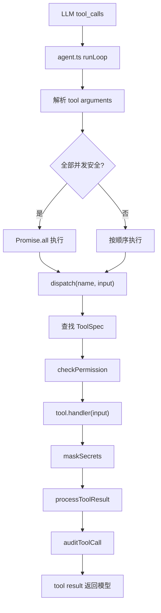
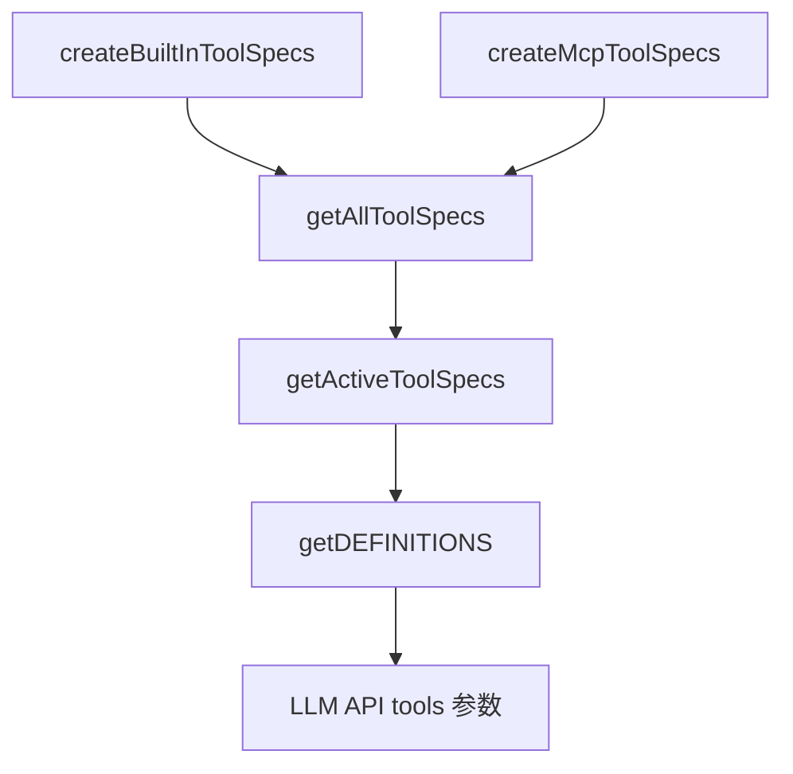
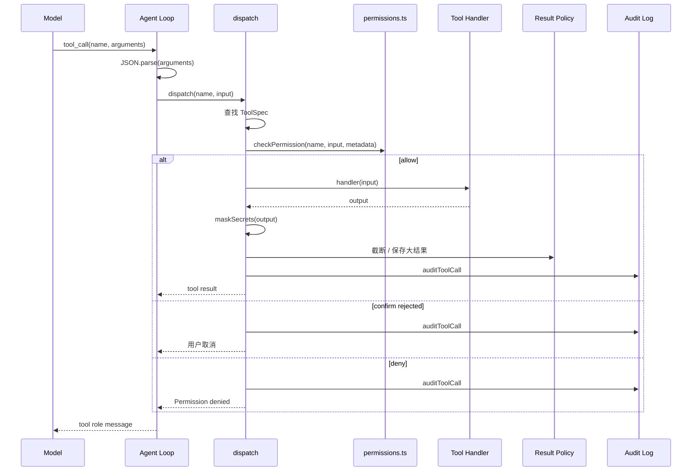
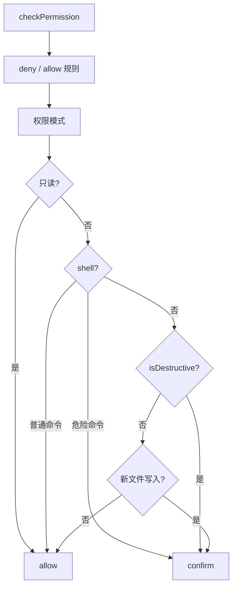
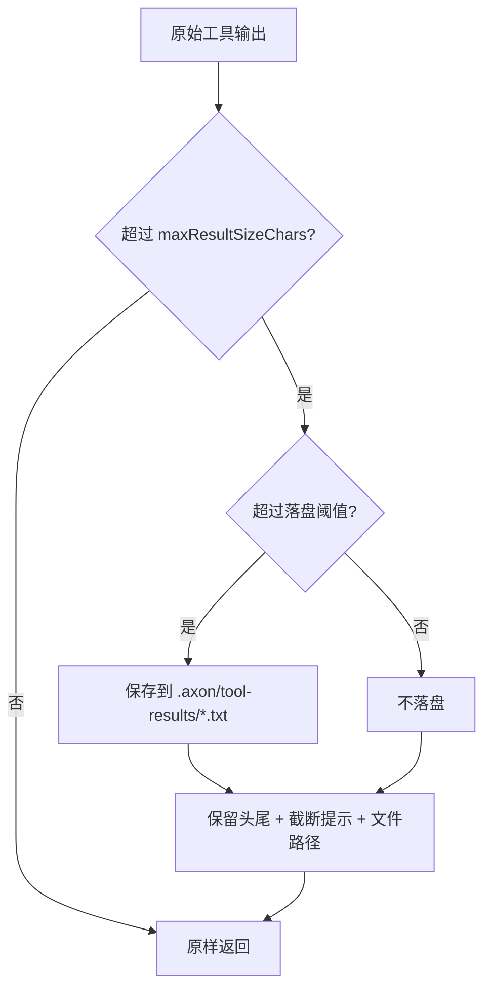
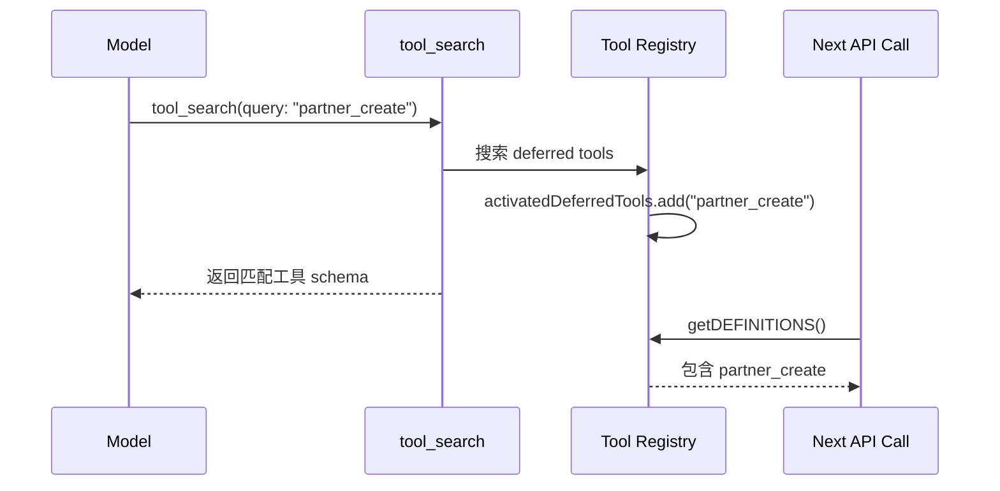

# Axon 工具系统设计

## 背景

Axon 的核心能力来自工具系统。模型本身只能生成文本，但工具让它能够读取文件、编辑代码、执行 shell、管理任务、调用记忆系统、启动后台任务和接入 MCP 外部能力。

一旦工具数量增加，工具系统就不再只是一个 `name -> function` 的分发表。它还需要回答几个更重要的问题：

1. 这个工具是否只读？
2. 它是否可以和其他工具并发执行？
3. 它是否有破坏性，是否需要确认？
4. 工具结果太大时如何处理？
5. 哪些工具应该常驻暴露给模型，哪些可以按需加载？
6. 编辑文件时如何避免幻觉替换和覆盖用户修改？

Axon 的工具系统设计目标，是把工具从“可调用函数”提升为“可治理的执行单元”。每个工具不仅有 schema 和 handler，还带有权限、并发、结果治理和延迟加载相关元数据。

---

## 设计目标

1. **统一入口**：所有工具调用都经过 `dispatch()`，便于权限、审计、脱敏和结果治理。
2. **工具契约化**：用 `ToolSpec` 描述工具行为，而不是把只读、危险、并发等判断散落在全局逻辑里。
3. **默认保守**：工具默认不是只读、不能并发、没有特殊权限；只有明确标注后才放宽。
4. **编辑安全**：文件编辑必须先读取，并通过 `mtime` 检测外部修改；字符串替换必须唯一匹配。
5. **结果可控**：超大工具输出统一截断，必要时保存完整结果到 `.axon/tool-results/`。
6. **性能可扩展**：只读工具可以并发执行；低频工具可以通过 `tool_search` 延迟激活。
7. **兼容现有工具**：保留已有工具名、输入参数和 OpenAI function calling schema，避免破坏模型使用方式。

---

## 总体架构

工具系统主要由 `src/tools/`、`src/permissions.ts` 和 `src/agent.ts` 组成。

```text
src/
├── agent.ts              # Agent loop，解析工具调用，决定串行或并发执行
├── permissions.ts        # 权限模式、规则、危险命令、审计和脱敏
└── tools/
    ├── index.ts          # ToolSpec 注册中心、dispatch、tool_search、结果治理
    ├── files.ts          # read/write/edit/list/search 文件工具
    ├── bash.ts           # 同步 shell 工具
    ├── background.ts     # 后台 shell 任务
    ├── compact.ts        # 手动上下文压缩工具
    ├── todo.ts           # 任务工具
    └── teams.ts          # 队友协作工具入口
```



这条链路刻意把职责分开：

- `agent.ts` 负责模型循环、流式响应和工具执行调度。
- `tools/index.ts` 负责工具注册、查找、执行和结果治理。
- `permissions.ts` 负责能不能执行。
- 具体工具文件只负责自己的业务逻辑。

---

## ToolSpec：工具的完整契约

Axon 使用轻量 `ToolSpec` 描述一个工具：

```ts
export interface ToolSpec {
  name: string;
  definition: object;
  handler?: ToolHandler;
  maxResultSizeChars?: number;
  deferred?: boolean;
  prompt?: string;
  isReadOnly?: (input: ToolInput) => boolean;
  isConcurrencySafe?: (input: ToolInput) => boolean;
  isDestructive?: (input: ToolInput) => boolean;
}
```

字段含义：

| 字段 | 说明 |
|------|------|
| `name` | 工具名，来自 function schema |
| `definition` | 传给模型的 OpenAI function calling schema |
| `handler` | 实际执行函数 |
| `maxResultSizeChars` | 返回给模型的最大结果字符数 |
| `deferred` | 是否默认隐藏，需要 `tool_search` 激活 |
| `prompt` | 预留的工具使用说明字段 |
| `isReadOnly(input)` | 当前输入下是否只读 |
| `isConcurrencySafe(input)` | 当前输入下是否可并发 |
| `isDestructive(input)` | 当前输入下是否具有破坏性 |

### 为什么元数据接收 input

同一个工具在不同输入下可能有不同语义。

例如 `bash`：

- `bash({ command: "git status" })` 可以视为只读。
- `bash({ command: "rm -rf dist" })` 显然不是只读。

所以 `isReadOnly` 和 `isConcurrencySafe` 不是工具级常量，而是函数。

### 默认保守

`spec()` 工厂的默认值是：

```ts
isReadOnly: () => false
isConcurrencySafe: () => false
isDestructive: () => false
maxResultSizeChars: 50_000
```

这是一种 fail-closed 设计。把只读工具误判成非只读，最多导致少一些并发或多一些权限判断；把写入工具误判成只读，则可能绕过安全边界。

---

## 工具注册

Axon 的工具池由三部分组成：

1. 核心工具：`read_file`、`write_file`、`edit_file`、`list_files`、`search_files`、`bash`。
2. 扩展工具：task、memory、team、background、compact、skill、subagent。
3. MCP 动态工具：运行时通过 `registerMcpTool()` 注册。



`getDEFINITIONS()` 每次调用都会重新构建当前 active 工具列表，因此 MCP 工具注册后可以自动出现在下一次模型调用中。

为了兼容原有调用方式，`DEFINITIONS` 仍然是一个 Proxy。旧代码可以继续把它当数组传给 API，但实际读取时会动态获取最新工具定义。

---

## 工具执行生命周期

一次工具调用的生命周期如下：



几个关键原则：

- 工具找不到时返回 `Error: unknown tool`，不抛异常，让模型有机会自我修正。
- 权限拒绝也作为工具结果返回，而不是中断整个 agent loop。
- 所有工具结果都经过 secret 脱敏和审计。
- 大结果处理发生在 dispatch 层，而不是分散在各工具里。

---

## 权限系统如何使用工具元数据

`dispatch()` 会把 `ToolSpec` 的行为元数据传给 `checkPermission()`：

```ts
checkPermission(name, input, undefined, {
  isReadOnly: tool?.isReadOnly?.(input) ?? false,
  isDestructive: tool?.isDestructive?.(input) ?? false,
})
```

权限层仍保留原有内置 Set 作为兜底，例如 `READ_TOOLS`、`EDIT_TOOLS`、`SHELL_TOOLS`。但新的优先信息来自工具自身。

权限决策大致是：



Plan 模式是特殊情况：即使 `bash ls` 被工具元数据标注为只读，Plan 模式仍然禁止 shell。这保证了“只读规划模式”的语义稳定。

---

## 文件编辑安全

文件工具位于 `src/tools/files.ts`。其中 `edit_file` 是最关键的写入工具。

### Read-before-edit

Axon 要求编辑已有文件前必须先读取该文件。

读取时，系统会记录文件绝对路径和 `mtimeMs`：

```text
read_file(path)
  -> read contents
  -> stat(path).mtimeMs
  -> readFileState[path] = mtimeMs
```

编辑或写入前会再次检查：

1. 文件是否存在。
2. 该文件是否已经被当前会话读过。
3. 当前 `mtimeMs` 是否仍等于上次读取时的值。

如果文件在读取后被用户或其他进程修改，工具会拒绝写入，并要求模型重新读取。

### 唯一字符串替换

`edit_file` 使用 search-and-replace，而不是行号编辑或整文件重写。

执行前会检查 `old_string`：

- 出现 0 次：拒绝，说明模型记忆中的文本不在文件里。
- 出现 1 次：允许替换。
- 出现多次：拒绝，要求提供更多上下文。

这能把模型幻觉变成显式失败，而不是静默修改错误位置。

### 引号归一化

LLM 有时会把直引号生成成弯引号，例如：

```text
"hello" -> “hello”
```

Axon 的 `edit_file` 会先做精确匹配。如果失败，再尝试把直引号和弯引号归一化后匹配。匹配成功后，替换的仍然是文件里的原始字符串，而不是归一化后的字符串。

这样可以降低无意义的编辑失败，同时不改变文件原本的字符风格。

### Diff 输出

编辑成功后，工具返回简易 diff：

```diff
@@ -12,1 +12,1 @@
- const msg = "hello";
+ const msg = "world";
```

这让模型和用户都能快速确认修改内容，也方便后续排查。

---

## 工具结果治理

工具输出可能非常大，例如：

- `npm test` 输出大量日志。
- `grep` 命中很多文件。
- MCP 工具返回长 JSON。
- 后台任务输出完整构建日志。

如果把这些内容全部塞回模型上下文，会挤占对话空间，甚至触发上下文超限。

Axon 在 `dispatch()` 后统一调用 `processToolResult()`：



截断策略是保留头尾，而不是只保留开头。原因是很多工具的重要信息在末尾，例如测试失败摘要、编译错误统计和命令退出信息。

超大输出会保存到：

```text
.axon/tool-results/
```

模型收到的结果中会包含完整结果路径。需要时，它可以再通过 `read_file` 或 `search_files` 精确读取相关部分。

---

## 并发执行

模型一次响应可能包含多个工具调用。过去 Axon 会按顺序执行所有工具。现在 agent loop 会判断整批工具是否都并发安全：

```ts
const canRunConcurrently =
  parsedToolCalls.length > 1 &&
  parsedToolCalls.every((tc) => isToolConcurrencySafe(tc.name, tc.input));
```

如果全部安全，则使用 `Promise.all` 并发执行；否则保持串行。

### 为什么整批判断

只要一批调用中包含写入、shell、未知工具或外部副作用工具，就使用串行执行。这样可以避免如下问题：

- 一个工具读取文件，另一个工具同时修改文件。
- 多个写入工具竞争同一状态文件。
- shell 命令和文件编辑交错导致难以预测。
- hook 和审计顺序变得混乱。

### 当前适合并发的工具

典型并发安全工具包括：

| 工具 | 原因 |
|------|------|
| `read_file` | 只读文件 |
| `list_files` | 只读目录 |
| `search_files` | 只读搜索 |
| `check_background` | 读取后台任务状态 |
| `skill_list` / `skill_read` | 读取技能信息 |
| `task_list` | 读取任务列表 |

写入工具、shell、后台启动、MCP 工具默认不并发。

---

## Deferred Tools 与 Tool Search

工具越多，传给模型的 schema 越大。低频工具长期常驻会浪费 token，也会增加模型选择工具时的干扰。

Axon 引入 deferred tools：

- 常用核心工具默认暴露。
- 低频工具默认隐藏。
- 模型需要时调用 `tool_search` 激活。
- 下一次模型调用会包含已激活工具的完整 schema。



### 当前 deferred 策略

常驻工具：

- 文件工具
- shell / background 查询
- task 工具
- compact
- skill 工具
- `tool_search`

延迟工具：

- memory 管理工具
- team / partner 工具
- subagent `task`
- legacy `todo`

任务工具保持常驻，是因为 Axon 的系统提示要求模型在多步骤任务中使用任务跟踪。如果把它们隐藏，模型会更难遵守基础协作协议。

---

## MCP 工具

MCP 工具通过 `registerMcpTool()` 动态注入：

```ts
registerMcpTool(definition, dispatcher)
```

内部保存两份状态：

| 状态 | 用途 |
|------|------|
| `mcpDefinitions` | 动态追加到工具 schema 池 |
| `mcpDispatchers` | 工具名到实际调用函数的映射 |

MCP 工具默认不是只读、不可并发，并且权限层会把外部 MCP 工具视为需要确认的外部能力。未来如果 MCP server 能提供更精确的只读/危险元数据，可以映射到 `ToolSpec` 上。

---

## 审计与脱敏

所有工具调用都会进入审计日志：

```text
.axon/security/audit.log
```

记录内容包括：

- 时间戳
- 工具名
- 输入摘要
- 权限决策
- 输出预览

工具输出和审计日志都会经过 `maskSecrets()`，对常见 API key、token、Bearer token 和私钥块做脱敏。

这不是完整的数据防泄漏系统，但能覆盖本地 agent 最常见的误输出场景。

---

## 设计取舍

### 为什么不用大型工具类体系

Claude Code 这类成熟系统有大量工具，适合使用完整工具类体系。Axon 目前工具数量较少，直接引入重型继承结构会增加维护成本。

因此 Axon 采用折中方案：

- 具体工具仍然是普通函数。
- 工具注册中心用 `ToolSpec` 包装行为元数据。
- 权限、并发和结果治理在统一入口处理。

这样既保留简单性，又能支持后续扩展。

### 为什么 search-and-replace 而不是行号编辑

行号编辑的问题是位置会漂移。一次插入或删除后，后续行号都可能失效。对 LLM 来说，多步编辑时维护行号偏移很容易出错。

search-and-replace 的优势是幻觉安全：模型提供的 `old_string` 不存在时，工具直接失败，要求重新读取文件。相比整文件重写，它更不容易静默丢失未修改代码。

### 为什么只并发全安全批次

更激进的策略可以把一批工具分组，例如先并发所有读，再串行写。但这会让工具结果顺序、hook 顺序和模型预期变复杂。

当前策略更保守：只有整批工具都安全才并发。它简单、可预测，也足以优化多文件读取和搜索这类高频场景。

---

## 后续方向

1. **更细的 bash 分类**：当前只用正则识别部分只读命令和危险命令，未来可以引入更可靠的 shell parser。
2. **MCP 元数据协商**：如果 MCP 工具能声明 read-only/destructive，可以直接映射到 `ToolSpec`。
3. **工具级 prompt 注入**：`ToolSpec.prompt` 已预留，未来可让工具自己贡献使用指南。
4. **结果文件清理策略**：`.axon/tool-results/` 可增加 TTL 或最大容量清理。
5. **配置文件保护**：对 `.axon/config.json` 等关键配置写入前做 schema 校验。
6. **更强并发调度**：未来可以按读写集合分组，而不是整批全安全才并发。

---

## 小结

Axon 的工具系统核心思想是：

> 工具不是函数列表，而是带权限、并发、结果治理和加载策略的执行单元。

`ToolSpec` 让工具行为变得可声明，`dispatch()` 让执行生命周期变得可治理，`edit_file` 的安全检查让模型幻觉显式失败，结果治理和 deferred tools 则让系统在工具数量和输出规模增长后仍然可控。

这套设计保持了 Axon 的轻量风格，同时为更复杂的本地 Agent 能力留下了扩展空间。
