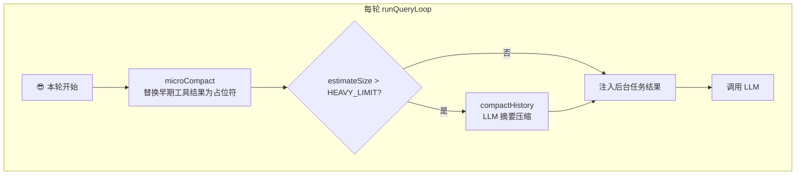
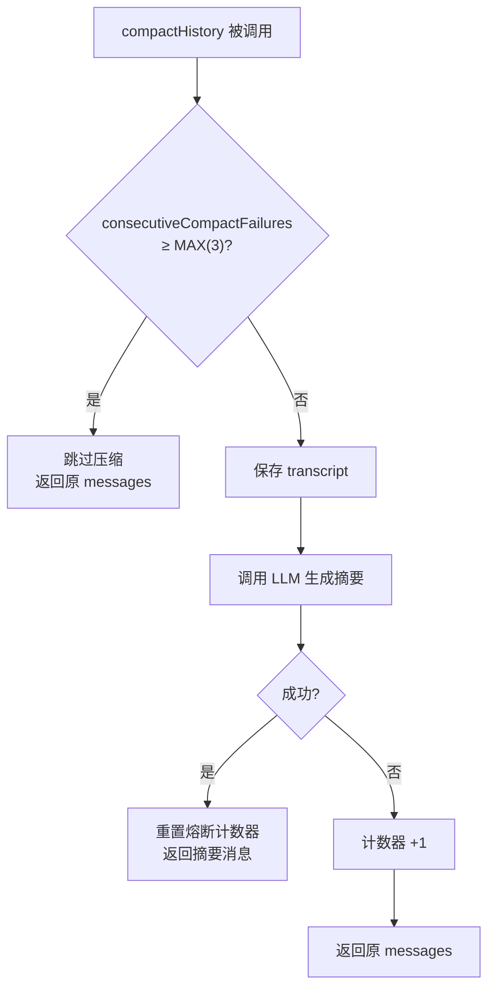

# Axon 上下文管理设计

## 背景

Agent 通过反复调用 LLM 来完成任务，每次调用都会把完整对话历史（messages）传给模型。这是 Agent 的天然工作方式——模型需要看到之前的工具结果、文件内容和决策才能继续工作。

但这种模式很快就遇到了问题。一个典型的 debug 流程，几轮下来 messages 就变得非常庞大：

```text
用户: 帮我修复这个 bug
助手: [读文件 A] → 报告 → [读文件 B] → 分析 → [grep 搜索] → 结果
助手: [编辑文件] → 结果 → [读文件验证] → 差异
助手: [执行测试] → 结果 → 修复完成
```

每轮工具结果可能几千到几万字，5-10 轮后对话历史轻松突破 50K-100K 字符。如果不加管理，下一轮 LLM 调用迟早会触发 token 限制。

Axon 的上下文管理设计，回答了三个问题：

1. **什么时候需要压缩？**——双阈值水位线：超过 LIGHT_LIMIT 先做无损微压缩，超过 HEAVY_LIMIT 再做有损摘要压缩。
2. **压缩什么？**——工具结果是膨胀主因，先处理它；对话逻辑部分用 LLM 摘要保留。
3. **压缩错了怎么办？**——压缩前保存完整 transcript；摘要压缩有熔断机制，失败时保持原样。

---

## 设计目标

1. **上下文大小可预测**：每轮 API 调用前都会检查水位线，确保不会突然爆掉。
2. **压缩尽可能无损**：先做 micro compact（替换占位符），不做摘要也能 recover。
3. **有损压缩有保障**：auto compact 有前向日志（transcript）和熔断器。
4. **连续压缩不退化**：使用双阈值分级策略，避免每轮都做重压缩。
5. **可观测**：压缩事件写入 logger，transcript 保存到磁盘。

---

## 消息增长模型

在理解压缩策略之前，先看消息是怎么增长的。

Axon 使用 OpenAI Chat Completions 风格消息。一次完整工具轮产生两类消息：

```text
{ role: "assistant", content: "...", tool_calls: [...] }
{ role: "tool", tool_call_id: "...", content: "工具结果" }
```

消息大小通常来自 tool result。assistant 的 tool_calls 很短，工具结果却可能包含文件全部内容。一组典型消息大小分布：

| 消息类型 | 典型大小 | 占比 |
|---|---|---|
| user / assistant 文字内容 | 几百字节 ~ 几千字节 | ~5% |
| tool 结果（小） | ~1KB | |
| tool 结果（大，如读文件） | ~10-50KB | ~95% |
| assistant tool_calls 声明 | ~100字节 | |

工具结果不仅是膨胀主因，而且**有冗余性**——模型调用 `read_file` 后，结果已经嵌入了它的推理，下一轮不需要再看到全量内容。

这就引出了 micro compact 的核心思想：**工具结果可以替换为占位符，模型看了占位符就知道它"看过这个文件"**。如果它需要具体内容，可以重新读。

---

## 架构：三层压缩流水线

Axon 的压缩逻辑全部位于 `src/compaction.ts`，在 `agent.ts` 的 `runQueryLoop()` 中每轮调用前触发。

```
src/compaction.ts
├── microCompact()      # 每轮静默执行，替换早期工具结果
├── compactHistory()    # LLM 摘要压缩（带熔断器）
├── estimateSize()      # 用 JSON.stringify 长度估算消息大小
├── LIGHT_LIMIT         # 轻阈值：触发 micro compact
└── HEAVY_LIMIT         # 重阈值：触发 compact history
```



### 第一层：micro compact（无损微压缩）

micro compact 是 Axon 的**第一道防线**。它不调用 LLM，不产生摘要，只是把早期工具结果替换成一段固定占位符：

```
[早期工具结果已压缩，如需重新获取请再次调用工具]
```

它的规则很简单：

1. 找到消息列表中所有 `role: "tool"` 的消息。
2. 如果工具结果数量 ≤ `KEEP_RECENT_RESULTS`（=3），什么都不做。
3. 否则，把最早的那些（前面全部减去最近 3 条）工具结果替换为占位符。
4. 跳过短内容（≤120 字符）和 skill 加载结果（以 `<skill name=` 开头）。

这个策略基于一个观察：**模型在最近几轮看到的最新工具结果是最关键的**，更早的结果模型已经消费过，只需要保留一个"记忆标记"。

效果：假设 10 条工具结果每条 10KB，micro compact 后保留最近 3 条（30KB），前面 7 条变占位符（~0.5KB），省去 ~70KB。

### 第二层：compact history（有损摘要压缩）

当消息总量超过 `HEAVY_LIMIT`（80K 字符）时，micro compact 已经不够了。Axon 调用 LLM 生成对话摘要：

```text
[对话已压缩]

用户报告了 X 错误。助手：
1. 读取了 src/a.ts，发现第 42 行条件判断写反了
2. 修改了该行并执行测试验证
3. 测试通过，确认修复完成
```

整个对话历史被替换为单条 user 消息。

**压缩前保护措施：**

- 完整 transcript 写入 `.axon/transcripts/transcript-{timestamp}.jsonl`
- 每条消息一行 JSON，便于事后 grep 和定向恢复

**熔断器：**

摘要压缩需要额外 LLM 调用，可能失败。如果连续失败 3 次，`compactHistory` 会触发熔断，本轮及后续对话不再尝试 auto compact。这会失去压缩能力，但保证了对话不崩溃。



### 手动压缩：LLM 调用 compact 工具

除了自动触发，LLM 也可以主动调用 `compact` 工具。这在 LLM 感觉上下文太长时触发，等效于 auto compact。

```text
助手: ...让我先压缩对话再继续...
[调用 compact 工具]
系统: "压缩完成，继续对话。"
助手: 好，刚才我们在讨论...
```

这个路径在 `agent.ts` 中被特殊处理：捕获 compact 工具调用后，先 push 一条 `role: "tool"` 反馈给 LLM，然后执行 `compactHistory`。

---

## 双阈值策略

双阈值是降低 token 浪费的关键设计。

```ts
const LIGHT_LIMIT = 40_000;   // JSON.stringify 字符数
const HEAVY_LIMIT = 80_000;
```

```
消息大小区间              行为
─────────────────────────────────────────────
0 ~ LIGHT_LIMIT (40K)    不压缩，零开销
LIGHT_LIMIT ~ HEAVY_LIMIT  micro compact，无损替换
HEAVY_LIMIT ~ ∞           micro compact + compact history
```

为什么是双阈值而不是单阈值？

- 如果把阈值设低（比如 40K），一旦超过就做 LLM 摘要，消息在 40K~80K 之间频繁波动，每轮都触发昂贵的摘要调用。
- 如果把阈值设高（比如 80K），低于 80K 时完全不处理，工具结果可能已经膨胀到 70K，下一轮再加一条就可能突破模型限制。

双阈值的做法是："小膨胀用低成本方法处理，大膨胀才用高成本方法。"

**一次典型会话的压缩历程：**

```
第 1 轮: 30K  → 不触发
第 2 轮: 45K  → micro compact → 30K
第 3 轮: 50K  → micro compact → 35K
第 4 轮: 85K  → micro compact + compact history → ~1K（摘要）
第 5 轮: 10K  → 不触发（刚压缩完）
第 6 轮: 45K  → micro compact → 30K
```

注意第 4 轮，micro compact 先执行（省 ~5K），然后发现仍超 HEAVY_LIMIT，再触发 compact history。流水线顺序很重要。

---

## 设计取舍

### 为什么保留 KEEP_RECENT_RESULTS=3 条不变

这是经过测试的平衡点。保留 1 条太激进——LLM 刚发出的工具调用结果，下一轮还需要看到才能继续推理。保留 5 条太保守——micro compact 效果打折扣。3 条是好的折中：模型能在最近 3 轮内看到上下文，更早的已经被消费过。

### 为什么用字符数而不是 token 数

`JSON.stringify(messages).length` 是一个粗略的估计值，不是精确的 token 计数。原因是：

1. token 计数需要调用 API 或加载 tokenizer，在循环中加入这个开销不划算。
2. 字符数与 token 数的比例在不同模型间存在差异，但 LIGHT/HEAVY_LIMIT 本身是经验值，不需要精确。
3. 即使 token 数超限，API 会返回 `prompt_too_long` 错误，Axon 会捕获并紧急压缩——双重保障。

### 为什么用 LLM 做摘要，而不是简单截断

简单截断（比如"保留前 N 条 + 后 M 条"）实现简单，但会在对话中间丢失关键决策。LLM 摘要是唯一能做到"保留完整决策链但体积缩小 50-100 倍"的方法。

代价是一次额外的 LLM 调用，约 1K-2K 输出 token。这在 80K+ 总消息的背景下是值得的——一次摘要能省出未来多轮的空间。

### 熔断器为什么设计为进程级状态

`consecutiveCompactFailures` 是模块级变量，不是实例级。这在多会话场景下有问题，但 Axon 当前是一个进程处理一个会话。简化了状态传递：不需要在 Session 和 compaction 函数之间传递失败计数。

---

## 测试与验证

### micro compact 测试

测试覆盖以下场景：

1. **低于 LIGHT_LIMIT**——不触发任何压缩，messages 不变。
2. **LIGHT_LIMIT ~ HEAVY_LIMIT**——仅触发 micro compact，早期工具结果被替换为占位符。测试验证前 3 条被 snip、最近 3 条完整保留。
3. **超过 HEAVY_LIMIT**——micro compact 和 compactHistory 都触发。
4. **多轮连续压缩**——每轮新加一条工具结果，micro compact 持续生效，稳定省 ~10KB/轮。
5. **工具结果 ≤ 3 条时**——不压缩，确保短对话不受影响。

### compact history 测试

1. **正常压缩**——LLM 返回有效摘要，熔断器重置。
2. **LLM 调用失败**——熔断器 +1，返回原 messages。
3. **连续失败 3 次**——熔断，后续调用跳过。
4. **压缩后继续对话**——摘要消息 + 新消息能正常工作。

### 集成测试

在 `agent.ts` 中测试实际 `runQueryLoop` 的双阈值触发流程，验证：

- 每轮 API 调用前都执行压缩检查
- micro compact 和 compactHistory 按水位线正确触发
- prompt_too_long 错误触发紧急压缩
- 压缩后 metrics 正确记录

---

## 后续方向

1. **自适应阈值**：当前 LIGHT/HEAVY_LIMIT 是固定值。可以根据模型的 context window 和实际 token 使用量动态调整。
2. **分层摘要**：对不同类型的工具结果做不同粒度的压缩。比如 `read_file` 结果可以完全 snip，`bash` 输出可以摘要关键行，`edit_file` 结果可以保留 diff。
3. **选择性恢复**：压缩后 LLM 可以请求恢复某条压缩结果。目前只能重新调用工具，未来可以 sticky 地存一份压缩前的完整内容，按需恢复。
4. **压缩率监控**：记录每次压缩的前后体积比，帮助调优阈值。
5. **多会话熔断器**：如果 Axon 支持多会话，熔断器需要改为实例级或持久化状态。

---

## 小结

Axon 的上下文管理基于一个简单原则：**能省则省，不能省就摘要。**

- micro compact 用最少成本（字符串替换）处理了最常见的膨胀源（工具结果），每轮省 ~10-70KB。
- compact history 在必要时刻用一次 LLM 调用把整个对话压缩到 ~1KB，代价是有损，但有 transcript 兜底。
- 双阈值确保小膨胀不触发大开销，大膨胀可以被优雅处理。
- 熔断器防止压缩失败滚雪球。

这套方案没有引入复杂的 token 计数或自适应算法，而是用三个边界条件（3 条保留、40K 轻阈值、80K 重阈值）把上下文大小控制在一个可预测的范围内。
